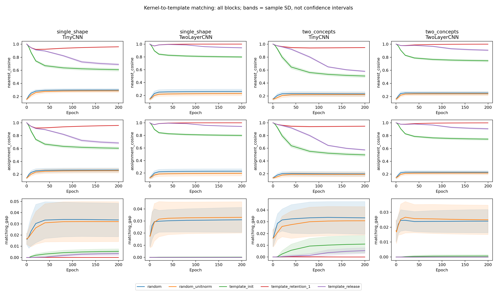
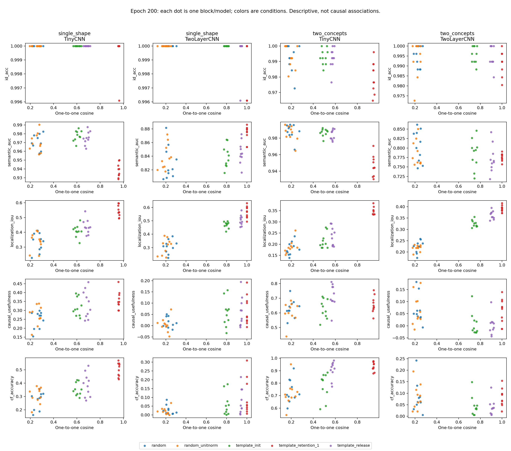

# Kernel similarity follow-up

200 models; 2000 checkpoints; all 256 kernel/template pairs at each checkpoint.

Maximum discrepancy from saved alignment: 0. No training or forward evaluations performed.

Exploratory morphology analysis. Similarity is not human interpretability. Correlations are within-condition descriptive summaries over ten blocks, not causal evidence.

| Task / model | Condition | Nearest cosine | One-to-one cosine | Gap | Unique nearest templates |
|---|---|---:|---:|---:|---:|
| single_shape / TinyCNN | random | 0.3000 ± 0.0226 | 0.2666 ± 0.0326 | 0.0335 ± 0.0149 | 9.7000 ± 1.7029 |
| single_shape / TinyCNN | random_unitnorm | 0.2881 ± 0.0223 | 0.2561 ± 0.0343 | 0.0320 ± 0.0178 | 9.7000 ± 1.7029 |
| single_shape / TinyCNN | template_init | 0.6101 ± 0.0211 | 0.6046 ± 0.0210 | 0.0055 ± 0.0023 | 13.3000 ± 1.3375 |
| single_shape / TinyCNN | template_release | 0.6897 ± 0.0166 | 0.6863 ± 0.0174 | 0.0034 ± 0.0016 | 14.2000 ± 1.0328 |
| single_shape / TinyCNN | template_retention_1 | 0.9590 ± 0.0033 | 0.9590 ± 0.0033 | 0.0000 ± 0.0000 | 16.0000 ± 0.0000 |
| single_shape / TwoLayerCNN | random | 0.2614 ± 0.0366 | 0.2304 ± 0.0388 | 0.0310 ± 0.0103 | 9.2000 ± 1.3166 |
| single_shape / TwoLayerCNN | random_unitnorm | 0.2282 ± 0.0329 | 0.1952 ± 0.0388 | 0.0330 ± 0.0129 | 8.3000 ± 1.8886 |
| single_shape / TwoLayerCNN | template_init | 0.7989 ± 0.0146 | 0.7988 ± 0.0148 | 0.0001 ± 0.0003 | 15.7000 ± 0.4830 |
| single_shape / TwoLayerCNN | template_release | 0.9425 ± 0.0062 | 0.9425 ± 0.0062 | 0.0000 ± 0.0000 | 16.0000 ± 0.0000 |
| single_shape / TwoLayerCNN | template_retention_1 | 0.9999 ± 0.0000 | 0.9999 ± 0.0000 | 0.0000 ± 0.0000 | 16.0000 ± 0.0000 |
| two_concepts / TinyCNN | random | 0.2320 ± 0.0342 | 0.1987 ± 0.0350 | 0.0334 ± 0.0139 | 9.1000 ± 1.5239 |
| two_concepts / TinyCNN | random_unitnorm | 0.2215 ± 0.0314 | 0.1906 ± 0.0369 | 0.0309 ± 0.0121 | 9.2000 ± 1.3984 |
| two_concepts / TinyCNN | template_init | 0.5074 ± 0.0221 | 0.4963 ± 0.0220 | 0.0110 ± 0.0075 | 12.0000 ± 1.0541 |
| two_concepts / TinyCNN | template_release | 0.5797 ± 0.0106 | 0.5743 ± 0.0102 | 0.0054 ± 0.0025 | 12.9000 ± 0.9944 |
| two_concepts / TinyCNN | template_retention_1 | 0.9468 ± 0.0040 | 0.9468 ± 0.0040 | 0.0000 ± 0.0000 | 16.0000 ± 0.0000 |
| two_concepts / TwoLayerCNN | random | 0.2547 ± 0.0273 | 0.2307 ± 0.0240 | 0.0241 ± 0.0078 | 9.6000 ± 1.0750 |
| two_concepts / TwoLayerCNN | random_unitnorm | 0.2430 ± 0.0277 | 0.2180 ± 0.0265 | 0.0250 ± 0.0099 | 9.0000 ± 1.0541 |
| two_concepts / TwoLayerCNN | template_init | 0.7464 ± 0.0172 | 0.7458 ± 0.0173 | 0.0007 ± 0.0010 | 15.4000 ± 0.6992 |
| two_concepts / TwoLayerCNN | template_release | 0.9067 ± 0.0118 | 0.9067 ± 0.0118 | 0.0000 ± 0.0000 | 16.0000 ± 0.0000 |
| two_concepts / TwoLayerCNN | template_retention_1 | 0.9989 ± 0.0005 | 0.9989 ± 0.0005 | 0.0000 ± 0.0000 | 16.0000 ± 0.0000 |

Gallery examples use block 2000 for every condition and both endpoints, with a shared centered/unit-norm colour scale. Raw norms are recorded separately. The redundant rank-10 bank limits diversity interpretations.

Matrices are indexed by per_checkpoint.csv row; per_channel.csv identifies both best and assigned template for each channel. Assignment maximizes total signed cosine; assignment_distance describes that same matching and is not a separately optimized Euclidean assignment.

The independent experimental submission audit remains pending.
