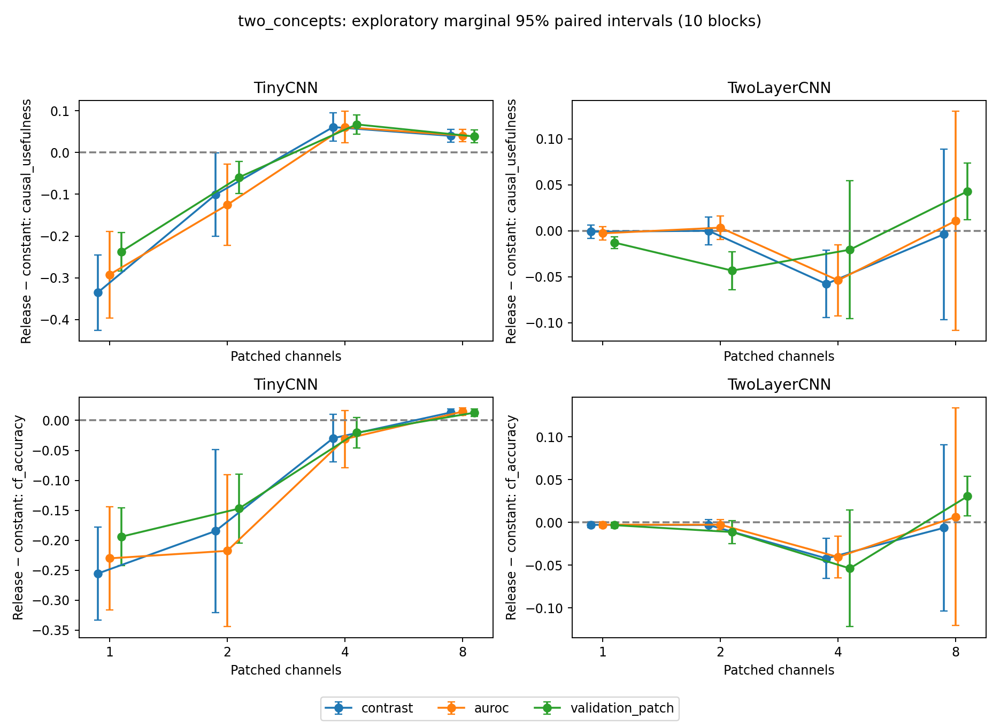

# Does the causal conclusion survive measurement changes?

All 80 GPU evaluations are present. Raw JSON yielded 960 method/size records. Maximum original-k4 U difference versus stored CPU results: 1.29e-07; test accuracy difference: 0. All stored full/no-op checks and validation-selection denominators passed.

## Finding

The result survives **particular** changes, not all changes. On two_concepts / TinyCNN, all three selection methods yield positive release-minus-constant U at k4 and k8, but negative differences at k1 and k2. Thus the apparent advantage is patch-budget dependent and not merely an artifact of the original contrast ranking.

For TwoLayerCNN, contrast and AUROC show negative differences at k4; validation-patch ranking gives a negative mean with an interval spanning zero. At k8, validation-patch ranking gives a positive difference. A universal claim that release improves shallow causal usefulness and harms deeper causal usefulness is therefore too broad.

These are reused checkpoints/test data, post hoc analyses, and marginal intervals without multiplicity adjustment. A sign change is descriptive evidence of measurement dependence; it does not alone establish the mechanism. Singleton-based validation-patch ranking does not optimize joint subsets.

## Decision for the conditional replication

**Defer training the proposed confirmation of the broad architecture claim.** The original condition—robustness across measurement choices—is not established. This is a scientific assessment, not a predeclared statistical pass/fail threshold.

A narrower next question is whether release changes how causal effects are distributed across channel-set sizes. A fresh annotated-task protocol should then specify the full k curve and an architecture-by-treatment-by-budget contrast in advance, with an absolute counterfactual-accuracy endpoint alongside relative U. Do not choose only k4 because it supports the original story. Before committing to new training, decide whether this narrower question is necessary for the single paper; current evidence already supports an explicitly scoped measurement-sensitivity finding.

## Reproduce

From the repository root: `bash review_robustness.sh`. This reads existing uploaded results and regenerates this report, the plot, paired tables and audit. The original GPU runner remains `bash run_gpu.sh main`; rerunning against its original local output skips completed checkpoints. No new annotated-task training is launched.
