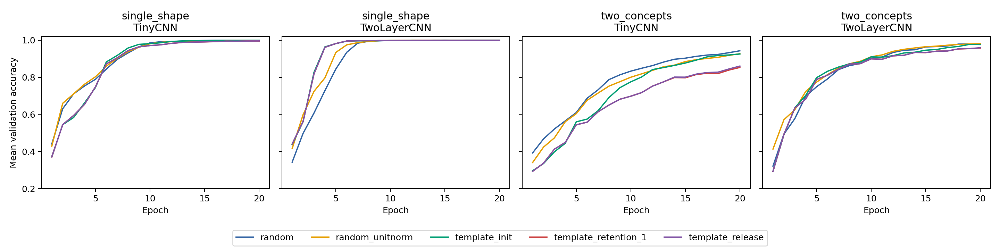
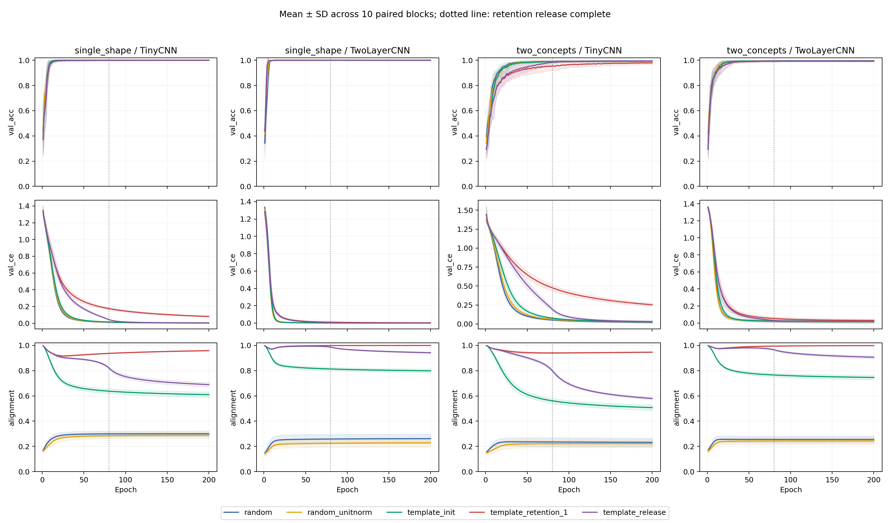
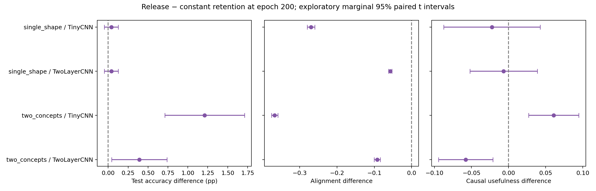
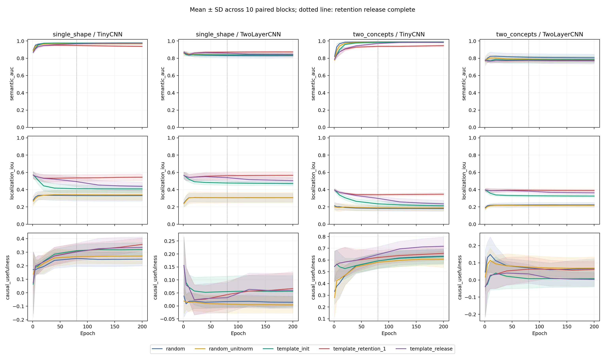
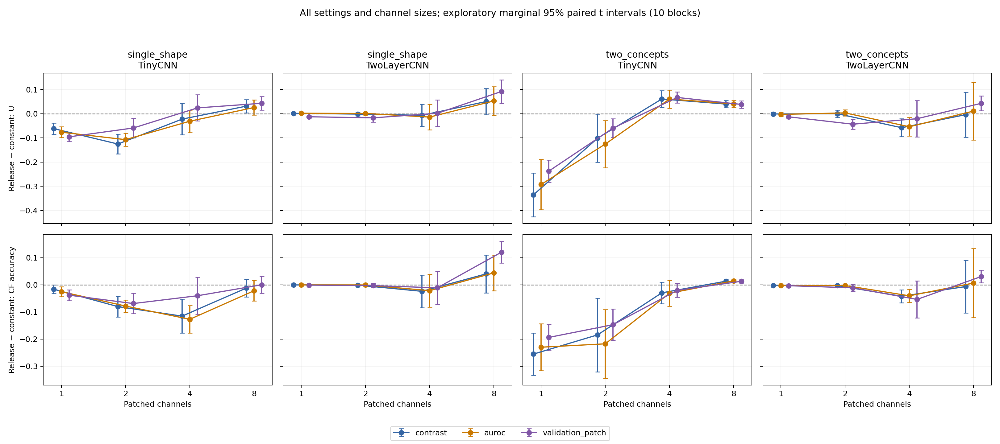

# Template Priors in Small CNNs: Learning Dynamics and the Measurement Dependence of Causal Usefulness

**Main manuscript — 8 September 2026.** One empirical paper combining a prospective alignment study, an exploratory retention-release study and a post hoc robustness analysis. Companion [complete results tables](supplementary_results.md) and [literature comparison](literature_comparison.md). Final independent reproducibility review is deferred; this is not yet a submission-certified artifact.

## Abstract

Structured convolutional priors can constrain kernel appearance, but the relationship between that appearance, learning dynamics and causal use of features remains unclear. We investigate this relationship in small CNNs on two controlled rendering tasks. A 400-run experiment with a locally fixed prospective protocol increases template alignment without establishing an improvement in selected-channel intervention fidelity under four Holm-corrected primary tests. A subsequent 200-run experiment extends training and gradually releases the retention penalty. Template initialization does not uniformly accelerate learning and eventually matches normalization-matched random accuracy on the shallow compositional task. Releasing retention improves compositional accuracy relative to constant retention while reducing alignment. At the original four-channel intervention, its relative causal-usefulness difference is positive in TinyCNN and negative in TwoLayerCNN. A GPU reanalysis of 80 existing final checkpoints tests three validation-only channel rankings and four intervention sizes. On two_concepts in TinyCNN, all rankings yield negative release effects at one or two channels and positive effects at four or eight; deeper-model outcomes also depend on ranking and size. We therefore characterize a measurement-dependent ordering of retained versus released representations, rather than a universal interpretability benefit. The contribution is a controlled empirical connection between template constraints, optimization and intervention design. Later comparisons are exploratory, and these synthetic results do not establish general human interpretability or causal identifiability.

## 1. Motivation and research questions

Visual structure in a convolutional kernel is an attractive source of prior knowledge: an edge, corner or ring can be specified before training and recognized afterward. However, recognizing the filter's shape does not establish which concept its activation distinguishes, how the network uses it, or whether a small intervention can change the network's decision appropriately. Prior research already provides ways to initialize, parameterize or freeze filters, as well as tools for measuring concept alignment and intervening on units. The question here is how these measurements behave together when a template constraint is strengthened and subsequently released.

We ask whether greater retained template alignment accompanies independently measured concepts and useful matched interventions, whether an early learning advantage persists with longer optimization, and whether a comparative causal conclusion survives changes in selection and intervention size. We operationalize these questions using two related rendering tasks with known concepts and matched counterfactuals. Low-level kernel alignment is kept distinct from object-level concept selectivity and localization.

The study proceeds sequentially. A 400-run experiment fixes four primary contrasts before outcome inspection. Its unresolved causal result and frozen-head diagnostic motivate a longer 200-run experiment on fresh blocks. A subsequent 80-checkpoint reanalysis tests whether the new four-channel comparison depends on its measurement. These stages have different statistical status and are not pooled as independent replications of one effect.

Our contributions are: (i) a controlled comparison of template strength with renderer-based concept and intervention measures, including matched normalization and spectrum controls in the initial stage; (ii) longitudinal evidence separating initialization, continued retention and release; and (iii) a documented reversal of the relative release effect across channel budgets under several validation-only rankings. We do not propose a new general filter family, claim that retained kernels are human-interpretable by construction, or claim priority for the general observation that patching choices matter.

## 2. Related work and contribution boundary

### 2.1 Structured and fixed convolutional filters

Gabor initialization is a direct antecedent: Özbulak and Ekenel initialize a CNN's first layer with a Gabor bank [1](#ref-1). Molaei and Shiri Ahmad Abadi explicitly address the loss of Gabor structure by learning its generating parameters, rather than freely updating every filter entry [2](#ref-2). PCFNet similarly replaces first-layer kernels with learnable predefined image filters [3](#ref-3). Wang and Alkhalifah apply constrained learnable Gabor kernels to seismic facies classification [4](#ref-4). Consequently, neither starting with interpretable-looking kernels nor preserving a structured family during learning is our novelty. Our edge/corner/ring anchors and soft weight-space penalty also differ from an exact Gabor parameterization: an anchored filter can leave the template family, and release explicitly removes that penalty.

Fixed filters need not preclude strong prediction. Linse, Barth and Martinetz keep spatial filters fixed and learn pointwise combinations in PFCNNs [5](#ref-5). ExplainFix studies spatially fixed initialization, steering and pruning [6](#ref-6). Gavrikov and Keuper show the capacity of trainable combinations of random convolutions [7](#ref-7). These works make downstream adaptation an essential alternative explanation for poor frozen performance. Our fixed-feature classifier diagnostic is evidence of a training gap in the tested shallow models, not a claim that fixed filters generally fail or succeed. Nor do our small-model experiments establish a speed or accuracy improvement over those architectures.

### 2.2 What kernel appearance and concept measurements establish

Chowers and Weiss analyze first-layer energy profiles and connect their consistency, including under random labels, to image statistics [8](#ref-8). Jorgenson et al. examine how properties such as sharpness, noise and color leave signatures in early filters [9](#ref-9). These results caution against treating recognizable kernel structure as sufficient evidence of semantic function. Our spectrum controls address some low-level properties, while renderer labels provide a distinct semantic measurement; neither removes every alternative explanation.

Network Dissection quantifies unit–concept correspondence [10](#ref-10), and Bau et al. subsequently examine causal roles of concept-related units through interventions [11](#ref-11). Concept Whitening explicitly aligns activation-space axes with known concepts [12](#ref-12). Our bank alignment instead concerns **weight space**, without concept supervision in the training objective. Thus high bank similarity, high object AUROC and foreground localization are different quantities. Their dissociation is an empirical result here, not a claim that the general distinction between representation and function is new. Related distinctions also arise in concept sidechannel models [13](#ref-13) and faithful concept-trace architectures [14](#ref-14), whose architectural assumptions and explanation mechanisms differ from ours.

### 2.3 Causal concepts and measurement-sensitive patching

CaCE distinguishes the effect of changing a concept from observational correlation [15](#ref-15). Our renderer directly constructs matched concept changes, but U is not CaCE: it measures how well internal patches reproduce this particular model's probability response relative to random patches. Zhang and Nanda demonstrate that corruption, output metric and joint patching choices can change localization results in language models; their sliding-window analysis already highlights dependence on intervention granularity [16](#ref-16). Heimersheim and Nanda distinguish exploratory localization, verification, and the evidence supplied by different patching procedures [17](#ref-17). Our measurements should be read with those distinctions, not as identifying a complete circuit or proving necessity.

The formal causal-abstraction literature also separates intervention agreement from unrestricted claims about explanations [18](#ref-18). The non-identifiability analyses of Méloux et al. [19](#ref-19) and alignment-map limitations studied by Sutter et al. [20](#ref-20) concern different mathematical settings; our channel-patching experiment neither proves nor resolves those problems. We make no unique-mechanism claim.

### 2.4 What this paper adds relative to these precedents

| Closest line of work | Established contribution | Specific role of the present study |
|---|---|---|
| Structured initialization and preservation [1–4] | Insert task-related filter structure and preserve a parameterized family | Compare soft retention and release with independent concept measures and matched interventions |
| Fixed/combined spatial filters [5–7] | Learn useful predictors with fixed structured or random filters and downstream mixing | Diagnose fixed-feature readout limitations; do not equate a short-run deficit with representation capacity |
| First-layer statistics [8–9] | Explain or infer low-level data properties from filter weights | Keep low-level appearance/spectrum separate from object concept and intervention outcomes |
| Unit concepts and interventions [10–15] | Quantify semantics, build concept-aligned representations or examine causal concept/unit roles | Measure these quantities while manipulating a template prior rather than training a concept bottleneck |
| Patching methods [16–17] | Show methodological and granularity sensitivity of circuit localization | Show a retention-versus-release comparison reversing across channel budgets in small vision models |
| Causal abstraction and identifiability [18–20] | Formalize causal explanations and their limitations | Restrict the claim to the measured finite interventions, without a general identification theorem |

The distinguishing contribution is the **combination of intervention-controlled training comparisons and the observed budget-dependent reversal**, not any component in isolation. Relative to the reviewed sources, this is a specific empirical extension at the intersection of structured filters and patching evaluation. The comparison does not establish that no unreviewed paper contains the same experiment. The [source-by-source evidence map](literature_comparison.md) records what was inspected and what each comparison can support.

## 3. Methods

### 3.1 Experimental stages and inferential roles

| Stage | Training/evaluation scope | Data blocks | Statistical status |
|---|---|---|---|
| A: alignment and controls | 400 models, 40 epochs, 10 conditions, 2 tasks, 2 architectures | 0–9 | Four locally prospective primary U tests; remaining comparisons exploratory |
| B: retention and release | 200 models, 200 epochs, 5 conditions, 2 tasks, 2 architectures | 2000–2009 | Design saved before training; reported comparisons exploratory |
| C: measurement robustness | 80 final checkpoints selected from B; 3 rankings × 4 sizes | Same as B | Post hoc reanalysis of existing models and test data |

A historical 28-run pilot motivated foundation repairs and is archived for provenance, but is excluded from the paper's clean comparison tables. The 600 trained models in A and B are not 600 independent draws of one treatment effect: conditions share data and initialization components within blocks, and the two stages use different horizons and treatment sets. Stage C adds no independent training sample.

Stages A and B use the same corrected renderer, architectures and bank. Stage A includes random, random_unitnorm, frozen_random_unitnorm, template_init, template_retention_0.1, template_retention_1, frozen_templates, spectrum_init, spectrum_retention_1 and frozen_spectrum. A common Fourier phase transform of the template bank preserves each kernel's Fourier magnitude and the bank's Gram matrix, singular values and rank at initialization. Frozen controls preserve their anchors; trainable controls can drift. They are matched spectral controls, not guaranteed semantically empty filters. “Frozen” refers only to the first convolution; the second convolution remains trainable when present.

Stage A uses Adam at 0.003, batch 128 and 40 epochs (160 updates), final-checkpoint evaluation and training/validation-only selection rules. The main Stage B/C methods follow below. Full Stage A details and its locally timestamped [protocol](../studies/cnn_causal_milestone/PROTOCOL.md) remain available.

### 3.2 Design, streams and data

In Stage B, the factorial design contains 2 tasks × 2 architectures × 10 blocks × 5 conditions = **200 runs**. Each model trains for 200 epochs. Blocks 2000–2009 use fresh deterministic streams, distinct from the earlier study's blocks 0–9. The master seed is 2026090617. Within a block, conditions share data, minibatch ordering and downstream initialization; block differences include both generated-data and initialization variation. The unit for paired uncertainty estimates is the block, not an image, epoch or intervention pair.

Each task/block contains 512 training, 256 validation and 256 test images. These correspond to 128, 64 and 64 independently generated nuisance contexts, respectively, each rendered in all four balanced states. Images are 32×32 grayscale. Stored data include labels, renderer concept indicators, visible masks, matched nuisance variants and context metadata. All splits use separate seed namespaces. Each training stage contains 20,480 main images shared across model conditions, plus nuisance variants. Stage C reuses Stage B images.

**single_shape** classifies line, circle, triangle and square. Every context renders all four identities under the same nuisance realization. **two_concepts** renders two objects: square/circle and line/triangle. The label is circle_present + 2×triangle_present. Object positions are swapped independently across contexts; single-bit interventions alter one identity while retaining the other.

Rendering varies angle from 0 to π/4, width from 0.8 to 1.6, scale from 0.85 to 1.15, translation, and Gaussian noise with standard deviation sampled between 0 and 0.05. A 5×5 occluder occurs with probability 0.1. Threefold antialiasing is used. Matched counterfactual images share nuisance context; separate nuisance images change translation and noise while preserving identities and the other sampled settings. This controlled distribution is not a natural-image benchmark.

### 3.3 Models and priors

**TinyCNN** uses a 1→16 convolution with 9×9 kernels, padding 4 and no bias, followed by ReLU, global max pooling and a four-class linear head (1,364 parameters). **TwoLayerCNN** adds a trainable 16→16 convolution with 3×3 kernels and ReLU before pooling (3,668 parameters). Both are small architectures; the comparison isolates added depth within this family, not broad architectural generalization.

The corrected prior contains 8 edge, 4 corner and 4 ring filters. Kernels are centered and normalized to unit norm. The bank has rank 10: genuine two-ray corners correct a flaw in the original archive, but edge redundancies remain. Stage B does not include Stage A's spectrum controls, so it cannot isolate every geometric confound in this new schedule comparison.

| Condition | Initialization | Retention schedule |
|---|---|---|
| random | Default PyTorch random | λ=0 |
| random_unitnorm | Same random draw, centered and unit norm | λ=0 |
| template_init | Corrected template bank | λ=0 |
| template_retention_1 | Corrected template bank | λ=1 throughout |
| template_release | Corrected template bank | λ=1 through epoch 10, decreasing linearly to 0 at epoch 80 |

All layers in Stage B are trainable; its five conditions do not include freezing. The release schedule is λ(e)=clip((80−e)/70,0,1). Release and constant-retention histories match exactly through epoch 10 in the saved measurements. Early differences between those two conditions therefore cannot be evidence for a release effect.

### 3.4 Optimization and recording

The loss is cross-entropy plus λ‖W−W_anchor‖²_F/‖W_anchor‖²_F, applied only to the first convolution. All template anchors have squared norm 16. Adam uses learning rate 0.003 and batch size 128; four optimizer steps per epoch give 800 steps per model. There is no learning-rate scheduler, early stopping or checkpoint selection. The final-epoch outcome is reported as final performance; 200 epochs is not assumed to guarantee convergence.

Every epoch records sample-weighted training loss/accuracy, validation loss/accuracy, retention coefficient and penalty, kernel alignment/norm, first-layer gradient norm and pooled feature norm. Training metrics aggregate predictions made during parameter updates; validation metrics evaluate the completed epoch. Saved checkpoints occur at initialization and epochs 1, 5, 10, 20, 40, 80, 120, 160 and 200. Model, optimizer and random state are retained for resumption.

The recorded environment is Python 3.11.16, PyTorch 2.14.0+cu130, NumPy 2.4.6 and Linux/WSL2, with two CPU threads. Despite the CUDA-enabled package name, the provided runner keeps tensors and models on CPU. Cross-study numerical comparisons can also reflect environment differences; the paired comparisons within this run are the principal evidence.

### 3.5 Independent concept and causal measurements

**Alignment** averages, over the 16 first-layer kernels, the maximum signed centered cosine similarity to the corrected bank. Multiple learned kernels may select the same template.

**Concept AUROC** measures held-out identity/presence discrimination by a single first-layer unit per concept. Channel and sign are chosen using validation-only standardized positive–negative activation contrasts. **Localization IoU** separately selects the validation-best foreground channel, using each channel's validation 95th-percentile activation threshold, and evaluates visible renderer masks on concept-positive test images. Localization channels can differ from AUROC channels. Neither metric selects channels by template resemblance.

**Matched patching** copies selected first-layer activation maps from a counterfactual image into its matched base image and propagates through the unchanged network tail. All 12 directed identity substitutions per test context are used for single_shape (768 pairs); two_concepts uses the eight directed one-bit changes (512 pairs). Validation concept contrasts select channels. The primary displayed patch size is four channels, compared with eight fixed random rankings of the same size; sizes one and eight are also retained.

For base probability p₀, actual image-counterfactual probability p₁ and internally patched probability pS, fidelity is

\[
F=1-\frac{\sum\|p_S-p_1\|_2^2}{\sum\|p_1-p_0\|_2^2},\qquad
U=F_{selected,4}-\operatorname{mean}(F_{random,4}).
\]

No-op fidelity is zero and full-channel fidelity is one when the denominator is nonzero. F is not a mediated fraction and is unbounded below. U measures a selected-set advantage over random sets, not all causal information in the representation. Ground-truth counterfactual accuracy is reported separately because fidelity can reproduce an incorrect model response. Alternative linear-head refits use fixed features, three regularization values and validation-loss selection; they do not replace main causal metrics. All 1,800 selected refits report successful solver termination, which is not a proof of global representation capacity.

### 3.6 Analysis and integrity

**Prospective tests (Stage A).** Before its main outcomes were inspected, the local protocol fixed template_retention_1 minus template_init in U at k4 for each of four task/architecture settings. Two-sided paired t tests use ten block differences; Holm adjustment covers that family of four. Displayed 95% t intervals are marginal, not Holm-adjusted simultaneous intervals. An alignment increase of at least 0.10 is a descriptive strong-manipulation threshold; an accuracy loss greater than five percentage points is flagged. The protocol was frozen locally, not externally preregistered, and was informed by the historical pilot. The four decisions remain inconclusive; later exploration does not revise them.

**Exploratory comparisons (Stages B/C and secondary A).** We analyze early mean validation accuracy over epochs 1–10, first epoch reaching 95% validation accuracy, final test outcomes and final-20-epoch validation-loss slopes. First threshold attainment can be transient and is not a sustained-convergence measure. All 200 runs reached the threshold, so these particular means have no non-attainment censoring.

Paired differences use ten blocks per setting. We provide marginal 95% Student-t intervals, assuming reasonably behaved block differences. For paired differences d₁,…,d₁₀, these are mean(d) ± t₀.₉₇₅,₉ SD(d)/√10. A difference between two subgroup point estimates is not itself a tested architecture interaction. The release schedule and training design were saved before execution; the present contrasts, displays and statistical analysis were assembled after outcomes were available. They are **exploratory**, not a newly preregistered confirmatory test family. Intervals are not adjusted for the many outcomes and contrasts. We do not promote isolated intervals excluding zero into confirmatory claims. Curves display means ± standard deviations across blocks; epochs are not independent replicates.

The upload manifest verified 12,129 files with no mismatches, and core/experiment hashes matched the supplied source. The present analysis independently checked the published tables against all raw histories and scalar evaluation JSON files: 40,000 epoch records and 1,800 checkpoint evaluations. Stored full/no-op identities and defined fidelity denominators passed checks. This is artifact and numerical-consistency validation; it does not independently rerun every saved model's forward pass. Raw imported evidence is unchanged.

### 3.7 GPU robustness evaluation of existing checkpoints

To test the dependence of the original four-channel result on its measurement, we reevaluate the final checkpoints for template_release and template_retention_1: 2 tasks × 2 architectures × 10 blocks × 2 conditions = **80 checkpoint evaluations**. These are a subset of the existing 200 models, not new training runs or independent replications. Each checkpoint produces 3 ranking methods × 4 intervention sizes = 12 method/size records, for **960 records** in total. The validation and test splits are unchanged.

We compare three validation-only rankings:

- **contrast:** the original standardized positive–negative concept activation contrast.
- **auroc:** descending absolute deviation of validation concept AUROC from 0.5. Inverse discrimination can therefore rank highly.
- **validation_patch:** descending single-channel counterfactual fidelity, calculated separately for each destination identity or toggled concept on validation pairs. This uses the model's downstream behavior, unlike the two observational rankings. It ranks singleton effects; it does not optimize a joint channel subset.

Each ranking is evaluated at k=1, 2, 4 and 8 channels. Every size has eight same-size random controls, using the same original seed namespace and shared rankings across conditions within a task/block. Test outcomes are not used to select channels. Undefined validation denominators invalidate the intervention-selected U rather than supporting a conclusion; no such invalid selections occurred in the uploaded results. Selected fidelity, random fidelity, U, counterfactual accuracy, prediction agreement and correct-pair conditional accuracy are retained separately.

Inference and patching use CUDA float32 with mixed precision and TF32 disabled. One checkpoint is evaluated at a time. Actual full-channel and no-op forward passes check the implementation. The original contrast/k4 outcome is compared with its stored CPU value: the maximum absolute U difference across all 80 checkpoints is 1.29×10⁻⁷, and ordinary accuracy is identical. These checks support numerical agreement for the existing measurement; they do not validate every possible causal interpretation.

The robustness protocol was written with knowledge of the original results. It is a post hoc sensitivity analysis on reused data. For each task, architecture, ranking and size, release-minus-constant differences are paired over ten blocks. Intervals remain marginal 95% t intervals, with no multiplicity correction. We display the full intervention-size curve rather than selecting a favorable size. There are 96 displayed robustness contrasts across four settings, three rankings, four sizes and two outcomes (U and counterfactual accuracy); all are retained in the supplement. The Stage B endpoint file contains all 160 exploratory contrasts defined in the post-outcome analysis, including unfavorable outcomes. No new confirmatory family or equivalence margin is retroactively assigned. Shared contexts, targets, rankings, epochs and methods do not increase the number of independent blocks.

## 4. Results

### 4.1 Prospective alignment tests and the readout diagnostic

Stage A increases alignment strongly in all four primary comparisons, but establishes no corrected U improvement. Differences below are template_retention_1 minus template_init after 40 epochs, not release effects.

| Setting | Δalignment | Δaccuracy (pp) | ΔU [marginal 95% interval] | Holm p |
|---|---:|---:|---:|---:|
| single_shape / TinyCNN | +0.268 | -0.23 | +0.0345 [+0.0018, +0.0672] | 0.1633 |
| single_shape / TwoLayerCNN | +0.172 | -0.04 | -0.0092 [-0.0513, +0.0329] | 1.0000 |
| two_concepts / TinyCNN | +0.289 | -6.13 | +0.0252 [-0.0306, +0.0811] | 0.9995 |
| two_concepts / TwoLayerCNN | +0.198 | -0.39 | -0.0074 [-0.0557, +0.0408] | 1.0000 |

The first marginal interval excludes zero, but its two-sided test does not survive Holm adjustment. None of these outcomes establishes equivalence or the absence of a useful effect. The shallow compositional setting additionally loses 6.13 accuracy percentage points, exceeding the predeclared descriptive flag. These results motivate investigation of optimization and measurement rather than a universal negative conclusion.

At fixed frozen-template features, a validation-selected alternative linear head raises TinyCNN mean test accuracy from 83.40% to 99.77% on single_shape and from 52.30% to 81.80% on two_concepts. This demonstrates unused predictive capacity within the tested fixed representation/readout family under the original training procedure. It does not establish an information-theoretic ceiling. Of 400 selected refits, 398 report successful solver termination; the two exceptions remain recorded. A further 200 head-patching evaluations were designed after inspecting partial outcomes and are exploratory, not additional independent trained models. Their results are retained in the [Stage A report](../studies/cnn_causal_milestone/REPORT.md).

### 4.2 Early template advantages depend on the setting

| Task / model | random | random_unitnorm | template_init | release / constant retention |
|---|---:|---:|---:|---:|
| single_shape / TinyCNN | 79.46% | 80.09% | 76.23% | 75.69% |
| single_shape / TwoLayerCNN | 79.29% | 84.21% | 87.55% | 87.52% |
| two_concepts / TinyCNN | 64.10% | 61.21% | 54.37% | 52.37% |
| two_concepts / TwoLayerCNN | 71.13% | 74.41% | 72.72% | 71.90% |

Values are mean validation accuracy averaged over epochs 1–10. Template_init minus random_unitnorm is +3.34 percentage points [1.25, 5.42] for single_shape / TwoLayerCNN, but −6.84 [−10.26, −3.43] for two_concepts / TinyCNN. The other marginal intervals include zero. Thus even the direction of the early difference depends on task and architecture. The normalized random control reduces the apparent benefit relative to default random.

**Figure 1.** Mean validation accuracy over the first 20 epochs, by task, architecture and condition.

Time-to-threshold and early area are not interchangeable. On single_shape / TinyCNN, template_init has a lower early average but reaches 95% at mean epoch 7.7, compared with 8.2 for random_unitnorm. On two_concepts / TinyCNN, release reaches 95% at epoch 46.5 on average, versus 66.8 for constant retention, 23.4 for template_init and 25.5 for random_unitnorm. Release improves the constrained model's threshold time, but does not make it the fastest learner.

### 4.3 Longer training removes much of the apparent shallow-model deficit

On two_concepts / TinyCNN, template_init rises from 97.66% test accuracy at epoch 40 to 99.30% at epoch 200, matching random_unitnorm's final 99.30%. Constant retention also improves substantially, from 92.54% to 98.01%. The initial short-budget deficit therefore did not establish that templates were stuck at a fixed representational ceiling. The constrained model still improves late: its mean final-20-epoch validation-loss slope is negative. Continued improvement does not guarantee eventual equality, but it precludes treating the observed training horizon as a proven asymptote.

**Figure 2.** Learning and alignment trajectories over the complete training horizon; bands show block standard deviations.

### 4.4 Release improves compositional accuracy but sacrifices alignment

| Setting | Constant retention accuracy | Release accuracy | Paired gain, pp [95% interval] | Alignment: constant → release |
|---|---:|---:|---:|---:|
| single_shape / TinyCNN | 99.96% | 100.00% | +0.04 [−0.05, 0.13] | .959 → .690 |
| single_shape / TwoLayerCNN | 99.92% | 99.96% | +0.04 [−0.05, 0.13] | 1.000 → .942 |
| two_concepts / TinyCNN | 98.01% | 99.22% | +1.21 [0.71, 1.71] | .947 → .580 |
| two_concepts / TwoLayerCNN | 99.14% | 99.53% | +0.39 [0.04, 0.74] | .999 → .907 |

Release reduces mean alignment in all four settings. It retains more alignment than template_init in each setting, indicating dependence on the optimization path after λ reaches zero. This does not isolate alignment as the cause of any accuracy difference; the schedule changes the learned representation and downstream adaptation jointly.

**Figure 3.** Paired final release-minus-constant effects with exploratory marginal 95% intervals.

### 4.5 Independent concept and causal outcomes do not move uniformly

| Setting | AUROC constant → release | Localization IoU constant → release | U constant → release | Paired ΔU [95% interval] |
|---|---:|---:|---:|---:|
| single_shape / TinyCNN | .938 → .975 | .544 → .438 | .358 → .335 | −.022 [−.087, .043] |
| single_shape / TwoLayerCNN | .874 → .846 | .566 → .505 | .067 → .060 | −.007 [−.052, .039] |
| two_concepts / TinyCNN | .946 → .984 | .347 → .235 | .657 → .718 | +.061 [.027, .095] |
| two_concepts / TwoLayerCNN | .776 → .771 | .391 → .363 | .061 → .003 | −.058 [−.094, −.021] |

In the compositional task, reduced retention is associated with higher predictive accuracy in both architectures, but opposite selected-channel U differences. In TinyCNN, reduced alignment accompanies better single-unit concept discrimination and a higher U; in TwoLayerCNN, the U advantage largely disappears. Localization falls in all four settings. Object foreground overlap, identity selectivity and selected-set patching usefulness therefore cannot be substituted for each other.

The distinction between relative fidelity and intervention correctness is visible even within TinyCNN: on two_concepts, release has U=.718 versus .657 for constant retention, while selected-patch counterfactual accuracy is **90.64% versus 93.61%**. A higher advantage over random patches need not mean higher absolute intervention accuracy. In TwoLayerCNN, selected counterfactual accuracy is only 4.02% for release despite 99.53% ordinary accuracy; four first-layer channels often fail to enact the intended change. This could reflect distributed coding, the channel-ranking rule or downstream nonlinear interaction, rather than absence of causal information.

**Figure 4.** Concept and intervention measurements across recorded checkpoints; bands show block standard deviations.

### 4.6 The causal contrast depends on intervention size and selection

The GPU robustness evaluation changes the interpretation of the original architecture comparison. On two_concepts / TinyCNN, **all three selection methods** yield negative release-minus-constant U at k1 and k2, but positive differences at k4 and k8. This consistency across rankings makes a failure specific to the original contrast ranking an insufficient explanation. However, the reversal across sizes rules out describing release as uniformly more causally useful under these interventions.

The table gives mean paired ΔU [marginal 95% interval] on two_concepts. The corresponding results for both tasks, including absolute counterfactual accuracy, are retained in the [complete paired table](../analysis/patch_robustness_gpu_001/paired_contrasts.csv).

| Architecture | Ranking | k=1 | k=2 | k=4 | k=8 |
|---|---|---:|---:|---:|---:|
| TinyCNN | contrast | -0.335 [-0.425, -0.245] | -0.101 [-0.201, -0.001] | +0.061 [+0.027, +0.095] | +0.040 [+0.025, +0.055] |
| TinyCNN | auroc | -0.292 [-0.396, -0.189] | -0.125 [-0.223, -0.028] | +0.061 [+0.023, +0.098] | +0.040 [+0.026, +0.055] |
| TinyCNN | validation_patch | -0.237 [-0.283, -0.191] | -0.060 [-0.098, -0.021] | +0.067 [+0.044, +0.090] | +0.038 [+0.023, +0.054] |
| TwoLayerCNN | contrast | -0.001 [-0.008, +0.006] | -0.000 [-0.015, +0.015] | -0.058 [-0.094, -0.021] | -0.004 [-0.096, +0.089] |
| TwoLayerCNN | auroc | -0.003 [-0.010, +0.005] | +0.003 [-0.009, +0.016] | -0.054 [-0.092, -0.015] | +0.011 [-0.108, +0.130] |
| TwoLayerCNN | validation_patch | -0.013 [-0.019, -0.007] | -0.043 [-0.064, -0.023] | -0.021 [-0.095, +0.054] | +0.043 [+0.012, +0.074] |

In TwoLayerCNN, contrast and AUROC retain negative k4 differences. Validation-patch ranking gives a negative k4 mean with an interval spanning zero, and a positive k8 difference. Thus the deeper-model conclusion also depends on the measurement. These marginal intervals describe the observed sensitivity; they are not separate confirmatory discoveries.

**Figure 5.** Release-minus-constant differences in U (top) and counterfactual accuracy (bottom), with identical vertical scales within each row. All four settings and all four sizes are shown. Intervals are marginal and exploratory; see [Supplement S3](supplementary_results.md#s3-complete-measurement-robustness-contrasts) for all 96 numerical contrasts.

The figure shows relative U and absolute counterfactual-accuracy differences separately. U compares selected-channel reconstruction with a same-size random baseline, so its change can reflect either component. Because those baselines also change with k, a sign reversal in ΔU does not alone prove that causal information has become more distributed. It establishes that the comparative conclusion depends on intervention budget. Diagnosing concentration, redundancy or channel interactions requires additional analysis beyond ranking singleton effects.

## 5. Interpretation

The motivating early-advantage/late-constraint hypothesis receives partial, conditional support. Templates can provide an early advantage, as in single_shape / TwoLayerCNN, but do not generally do so. Template initialization alone catches up on the shallow compositional task. Constant retention leaves a residual fixed-budget cost, and release alleviates that cost. Thus initialization and persistent constraint must be distinguished before attributing late performance to templates themselves.

At the original four-channel measurement, release lowers alignment and improves compositional prediction in both architectures, while the selected-channel U difference changes sign with depth. The robustness evaluation shows that this is a conditional measurement result, not an established general mechanism: changing intervention size can reverse the shallow-model contrast, and changing selection and size alters deeper-model outcomes. The experiments support explicit separation of feature appearance, concept discrimination, localization, relative fidelity and absolute intervention correctness.

A plausible hypothesis is that retention changes the concentration or interaction of useful information across channels. That hypothesis remains unproven. Relative U includes a size-dependent random baseline; singleton rankings do not characterize joint effects, and patched activation combinations may be unnatural. We therefore report measurement sensitivity as the observed result and distributed coding as a possible explanation requiring separate evidence.

These results do not supersede the earlier study's four inconclusive corrected tests. The release experiment uses fresh blocks, a longer horizon and a different treatment; the robustness analysis then reuses its final models and test data. Together they form one empirical investigation, with different evidential roles. Neither the number of checkpoints nor the number of ranking/size combinations should be presented as additional independent replication.

## 6. Limitations

- Only two related synthetic tasks, two small architectures and one template bank are covered. No natural-image or human-readability validation is present.
- Conditions share balanced rendered contexts. This improves control but simplifies real concept correlations. Whole-object concepts do not independently certify every local primitive represented in the prior.
- A single release schedule, optimizer and horizon were tested. No claim of optimal scheduling or convergence follows. There are only ten independent blocks per setting.
- Repeated checkpoint test evaluation was scheduled and does not alter training, but subsequent schedule development using these curves would require new held-out evidence.
- Exploration spans many outcomes, rankings, sizes and contrasts. Marginal intervals do not control familywise error, and no practical-equivalence margin was fixed. The robustness analysis reused the same test data after the original findings were known; validation-only selection does not make this an independent confirmation.
- Patching may generate unnatural combinations of feature maps even when source and target images are matched. Fidelity is tied to probability outputs, confidence and the chosen ranking/layer. Probability saturation and negative-component sensitivity are known issues [16–17]; this study has not established robustness to logit- or divergence-based alternatives. Full/no-op identities are checks, not discoveries.
- Unit selection is refreshed from validation at each checkpoint. A metric trajectory can include changes in selected units, not just changes in one persistent feature. Stored probe arrays permit future unit-tracking analyses.
- The current result audit checks stored evidence rather than independently reproducing all model evaluations. Solver termination flags are not guarantees of representation optimality.
- Broader normalization/rank/spectrum controls from the earlier study were not crossed with the release schedule. Runtime comparisons are not analyzed.

## 7. Scope and future work

The present evidence supports a scoped empirical account of learning dynamics and measurement sensitivity in small CNNs. It does not justify automatically launching confirmation of a broad “release helps shallow and harms deeper causal usefulness” claim, because that claim changes with the measurement.

A future independent study could test whether retention changes causal-effect concentration across channel budgets. Its protocol should specify the full k curve, an architecture-by-treatment-by-budget contrast, absolute counterfactual accuracy alongside U, and a multiplicity plan before generating outcomes. Additional annotated tasks and readout controls would test external relevance and possible mechanisms. These are future directions, not results of this paper. The final independent reproducibility review is deferred. The current manuscript should not be described as fully submission-verified on the basis of stored-artifact checks alone.

## 8. Conclusion

Template initialization does not uniformly accelerate learning, and a short-budget deficit does not establish a template representation ceiling. Longer training lets the shallow compositional template-initialized model match normalization-matched random accuracy. Releasing retention improves on a constant constraint while sacrificing some template alignment, but its apparent causal-usefulness advantage depends on architecture, channel selection and intervention size. Across three rankings on two_concepts, the shallow-model contrast reverses between small and larger patches. These findings demonstrate why kernel appearance and a single patching score cannot substitute for a fully specified account of concept and intervention behavior. The contribution is a controlled characterization of these dependencies, with clearly bounded scope and exploratory uncertainty.

## Data and code availability

- [Original uploaded result provenance](../results/retention_release_001/README.md) and [saved design](../results/retention_release_001/design.json).
- [Runner and evaluation code](../studies/cnn_release_experiment/README.md).
- [Analysis script](../analysis/retention_release_001/analyze.py), [consistency audit](../analysis/retention_release_001/audit.json), [per-run endpoints](../analysis/retention_release_001/endpoints.csv), [means/SDs](../analysis/retention_release_001/summary.csv), and [paired marginal intervals](../analysis/retention_release_001/paired_contrasts.csv).
- From the repository root, run `python analysis/retention_release_001/analyze.py` in an environment with the study dependencies. It reads imported evidence and writes separate derived outputs, leaving the upload unchanged. Narrative text is reviewed prose and is not automatically rewritten by the plotting script.

- [GPU robustness protocol](../studies/cnn_patch_robustness/PROTOCOL.md), [uploaded GPU results](../results/patch_robustness_gpu_001/analysis/REPORT.md), and [review/audit](../analysis/patch_robustness_gpu_001/REPORT.md).
- [Robustness analysis code](../analysis/patch_robustness_gpu_001/review.py) regenerates the sensitivity figure and paired tables; run `bash review_robustness.sh` from the repository root. All historical and uploaded evidence remains unchanged.

The [supplement](supplementary_results.md) contains all condition means and the complete robustness comparison family. The [editorial status](MANUSCRIPT_STATUS.md) distinguishes completed manuscript work from the deferred final reproducibility review. Citation links below resolve to the provided primary-paper corpus wherever available; extraction defects are not treated as authoritative equations.

## References

The reusable [BibTeX bibliography](../literature/references.bib) and [citation-key map](citation_keys.md) support later LaTeX conversion. References identify versions in the supplied corpus; filenames are retrieval keys, not proof of publication year or venue. See the [bibliography review](../literature/BIBLIOGRAPHY_REVIEW.md) for verified publication metadata and version differences. Final venue-specific formatting remains editorial work.

[1] Özbulak, G., and Ekenel, H. K. **Initialization of Convolutional Neural Networks by Gabor Filters.** [Parsed paper](../literature/extracted/ozbulak_2018_gabor-initialization.md) · [PDF](../literature/pdf/ozbulak_2018_gabor-initialization.pdf).

[2] Molaei, S., and Shiri Ahmad Abadi, M. E. **Maintaining filter structure: A Gabor-based convolutional neural network for image analysis. Applied Soft Computing 88, 105960 (2020).** [Parsed paper](../literature/extracted/molaei_2020_gabor-filter-structure.md) · [PDF](../literature/pdf/molaei_2020_gabor-filter-structure.pdf).

[3] Ma, Y., Luo, Y., and Yang, Z. **PCFNet: Deep neural network with predefined convolutional filters. Neurocomputing 382, 32–39 (2020).** [Publisher / DOI](https://doi.org/10.1016/j.neucom.2019.11.075). This source is not present in the supplied corpus.

[4] Wang, F., and Alkhalifah, T. **Learnable Gabor kernels in convolutional neural networks for seismic interpretation tasks.** [Parsed paper](../literature/extracted/wang_2024_learnable-gabor.md) · [PDF](../literature/pdf/wang_2024_learnable-gabor.pdf).

[5] Linse, C., Barth, E., and Martinetz, T. **Convolutional Neural Networks Do Work with Pre-Defined Filters.** [Parsed paper](../literature/extracted/linse_2024_predefined-filters.md) · [PDF](../literature/pdf/linse_2024_predefined-filters.pdf).

[6] Gaudio, A., Faloutsos, C., Smailagic, A., Costa, P., and Campilho, A. **ExplainFix: Explainable Spatially Fixed Deep Networks.** [Parsed paper](../literature/extracted/gaudio_2023_fixed-filters.md) · [PDF](../literature/pdf/gaudio_2023_fixed-filters.pdf).

[7] Gavrikov, P., and Keuper, J. **The Power of Linear Combinations: Learning with Random Convolutions.** [Parsed paper](../literature/extracted/gavrikov_2023_random-convolutions.md) · [PDF](../literature/pdf/gavrikov_2023_random-convolutions.pdf).

[8] Chowers, R., and Weiss, Y. **What do CNNs Learn in the First Layer and Why? A Linear Systems Perspective.** [Parsed paper](../literature/extracted/chowers_2023_first-layer-filters.md) · [PDF](../literature/pdf/chowers_2023_first-layer-filters.pdf).

[9] Jorgenson, G., et al. **Scratching the Surface: Reflections of Training Data Properties in Early CNN Filters.** [Parsed paper](../literature/extracted/jorgenson26ajorgenson_2026_early-cnn-filters.md) · [PDF](../literature/pdf/jorgenson26ajorgenson_2026_early-cnn-filters.pdf).

[10] Bau, D., Zhou, B., Khosla, A., Oliva, A., and Torralba, A. **Network Dissection: Quantifying Interpretability of Deep Visual Representations.** [Parsed paper](../literature/extracted/bau_2017_network-dissection.md) · [PDF](../literature/pdf/bau_2017_network-dissection.pdf).

[11] Bau, D., Zhu, J.-Y., Strobelt, H., Lapedriza, A., Zhou, B., and Torralba, A. **Understanding the Role of Individual Units in a Deep Neural Network. PNAS (2020), doi:10.1073/pnas.1907375117.** [Parsed paper](../literature/extracted/bau_2020_causal-units.md) · [PDF](../literature/pdf/bau_2020_causal-units.pdf).

[12] Chen, Z., Bei, Y., and Rudin, C. **Concept Whitening for Interpretable Image Recognition.** [Parsed paper](../literature/extracted/chen_2020_concept-whitening.md) · [PDF](../literature/pdf/chen_2020_concept-whitening.pdf).

[13] Debot, D., and Marra, G. **Quantifying the Accuracy-Interpretability Trade-Off in Concept-Based Sidechannel Models.** [Parsed paper](../literature/extracted/debot_2025_accuracy-interpretability.md) · [PDF](../literature/pdf/debot_2025_accuracy-interpretability.pdf).

[14] Parchami-Araghi, A., Rao, S., Fischer, J., and Schiele, B. **FaCT: Faithful Concept Traces for Explaining Neural Network Decisions.** [Parsed paper](../literature/extracted/parchami-araghi_2025_faithful-concept-traces.md) · [PDF](../literature/pdf/parchami-araghi_2025_faithful-concept-traces.pdf).

[15] Goyal, Y., Feder, A., Shalit, U., and Kim, B. **Explaining Classifiers with Causal Concept Effect (CaCE).** [Parsed paper](../literature/extracted/goyal_2019_causal-concept-effect.md) · [PDF](../literature/pdf/goyal_2019_causal-concept-effect.pdf).

[16] Zhang, F., and Nanda, N. **Towards Best Practices of Activation Patching in Language Models: Metrics and Methods.** [Parsed paper](../literature/extracted/zhang_2024_activation-patching.md) · [PDF](../literature/pdf/zhang_2024_activation-patching.pdf).

[17] Heimersheim, S., and Nanda, N. **How to use and interpret activation patching.** [Parsed paper](../literature/extracted/heimersheim_2024_activation-patching.md) · [PDF](../literature/pdf/heimersheim_2024_activation-patching.pdf).

[18] Geiger, A., et al. **Causal Abstraction: A Theoretical Foundation for Mechanistic Interpretability.** [Parsed paper](../literature/extracted/geiger_2025_causal-abstraction.md) · [PDF](../literature/pdf/geiger_2025_causal-abstraction.pdf).

[19] Méloux, M., Portet, F., Maniu, S., and Peyrard, M. **Everything, Everywhere, All at Once: Is Mechanistic Interpretability Identifiable?.** [Parsed paper](../literature/extracted/meloux_2025_mechanistic-identifiability.md) · [PDF](../literature/pdf/meloux_2025_mechanistic-identifiability.pdf).

[20] Sutter, D., Minder, J., Hofmann, T., and Pimentel, T. **The Non-Linear Representation Dilemma: Is Causal Abstraction Enough for Mechanistic Interpretability?.** [Parsed paper](../literature/extracted/sutter_2025_causal-abstraction-limits.md) · [PDF](../literature/pdf/sutter_2025_causal-abstraction-limits.pdf).
