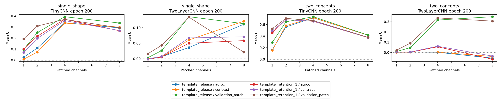

# Patching robustness

Completed 80/80 planned checkpoint evaluations. This is a post hoc sensitivity analysis on existing models/test data, not independent replication.

`metrics.csv` includes U, absolute counterfactual accuracy and random controls at every method/size. `paired_contrasts.csv` reports release minus constant retention with exploratory marginal paired t intervals; no multiplicity adjustment. Empty contrasts in a one-model smoke run are expected. `legacy_comparison.csv` checks original contrast/k4 against stored CPU outcomes; inspect differences before scientific interpretation. Channels are selected using validation only. Same-size random rankings are shared across conditions. Invalid selection denominators yield undefined U rather than a scientific conclusion.
