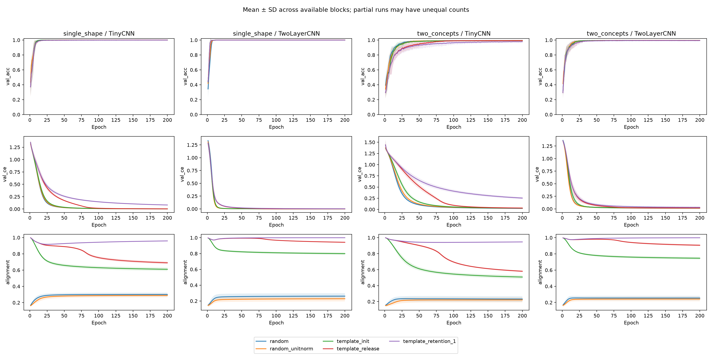
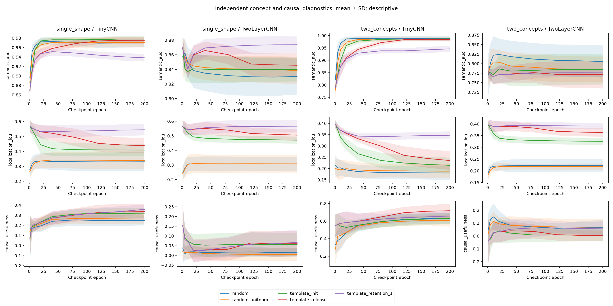

# Retention-release experiment results

Completed 200 of 200 planned runs. Observed 40000 epoch records.

These are descriptive results. Compare paired blocks; do not treat epochs or checkpoints as independent replicates. Non-attainment of 95% is recorded explicitly, not replaced with the final epoch. Test outcomes must not select a preferred release schedule or checkpoint.

| Task / model | Condition | Completed | Mean final validation accuracy | Reached 95% |
|---|---|---:|---:|---:|
| single_shape / TinyCNN | random | 10 | 100.00% | 10/10 observed |
| single_shape / TinyCNN | random_unitnorm | 10 | 100.00% | 10/10 observed |
| single_shape / TinyCNN | template_init | 10 | 100.00% | 10/10 observed |
| single_shape / TinyCNN | template_release | 10 | 100.00% | 10/10 observed |
| single_shape / TinyCNN | template_retention_1 | 10 | 99.96% | 10/10 observed |
| single_shape / TwoLayerCNN | random | 10 | 100.00% | 10/10 observed |
| single_shape / TwoLayerCNN | random_unitnorm | 10 | 100.00% | 10/10 observed |
| single_shape / TwoLayerCNN | template_init | 10 | 99.96% | 10/10 observed |
| single_shape / TwoLayerCNN | template_release | 10 | 100.00% | 10/10 observed |
| single_shape / TwoLayerCNN | template_retention_1 | 10 | 99.96% | 10/10 observed |
| two_concepts / TinyCNN | random | 10 | 99.34% | 10/10 observed |
| two_concepts / TinyCNN | random_unitnorm | 10 | 99.18% | 10/10 observed |
| two_concepts / TinyCNN | template_init | 10 | 99.34% | 10/10 observed |
| two_concepts / TinyCNN | template_release | 10 | 99.41% | 10/10 observed |
| two_concepts / TinyCNN | template_retention_1 | 10 | 97.85% | 10/10 observed |
| two_concepts / TwoLayerCNN | random | 10 | 99.38% | 10/10 observed |
| two_concepts / TwoLayerCNN | random_unitnorm | 10 | 99.49% | 10/10 observed |
| two_concepts / TwoLayerCNN | template_init | 10 | 99.57% | 10/10 observed |
| two_concepts / TwoLayerCNN | template_release | 10 | 99.49% | 10/10 observed |
| two_concepts / TwoLayerCNN | template_retention_1 | 10 | 99.26% | 10/10 observed |

Raw tables: `learning_curves.csv`, `per_run.csv`, `checkpoint_metrics.csv`. Selected-channel causal usefulness, concept AUROC, localization, and alternative classifier diagnostics are measured at scheduled checkpoints. Inspect those alongside accuracy and alignment; kernel resemblance alone is not semantic interpretability.

