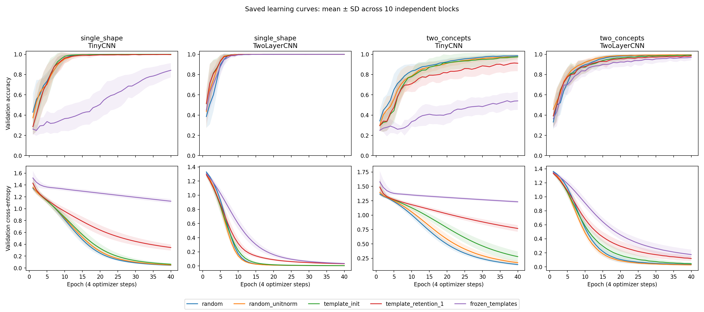

# Learning dynamics: exploratory follow-up

All 400 runs retain 40 epochs of training cross-entropy, training accuracy, retention penalty, validation cross-entropy and validation accuracy in each run's `history.json`. The consolidated table has 16,000 rows. Initial and final first-layer kernels and final model checkpoints are saved. Per-epoch model checkpoints, kernel alignment and causal metrics were not saved; those trajectories cannot be reconstructed exactly from loss histories alone.

Curves show means ± one standard deviation over ten independent blocks, not confidence intervals. This analysis was requested after the main results and is exploratory. Training accuracy is collected during parameter updates; validation measurements use each epoch's completed model. These are learning rates per optimizer step, not wall-clock speed comparisons.

## Does template initialization learn faster and then get stuck?

Mean validation accuracy averaged over epochs 1–10:

| Task / architecture | random | random_unitnorm | template_init |
|---|---:|---:|---:|
| single_shape / TinyCNN | 74.52% | 73.07% | 71.45% |
| single_shape / TwoLayerCNN | 80.57% | 85.91% | 87.88% |
| two_concepts / TinyCNN | 63.75% | 58.52% | 53.15% |
| two_concepts / TwoLayerCNN | 69.88% | 75.44% | 72.66% |

Templates have an early descriptive advantage in single_shape / TwoLayerCNN. Their advantage over random there shrinks with normalization matching. In two_concepts / TwoLayerCNN, template_init exceeds default random on this early average but trails random_unitnorm. In the shallow compositional setting, templates start slower. These averages do not establish statistical significance or uniform dominance at every epoch.

The 40-epoch data do not establish a plateau. Validation cross-entropy continues decreasing over epochs 31–40: for two_concepts / TinyCNN, the decrease is about 0.162 for template_init versus 0.085 for random. Strong retention and freezing must be distinguished from initialization alone: they constrain adaptation throughout training. A lower final score at a fixed training budget does not prove a lower attainable ceiling.

## Next controlled experiment

Use fresh independent blocks and prospectively compare random, random_unitnorm, template_init, constant template retention, and retention that decays to zero. Extend the training horizon, recording validation-based stopping diagnostics. Keep matched data, minibatch ordering, downstream initialization and optimizer settings across paired conditions.

Save checkpoints at fixed early and late epochs, plus per-epoch alignment, feature/gradient norms and loss. Measure renderer-based concept selectivity, localization and matched causal patching at the saved checkpoints. Predeclare early-learning area, time in optimizer steps to an accuracy threshold (report non-attainment), late accuracy and loss slope, and the accuracy–concept/causal trade-off. Use fresh held-out evaluation and account for multiple comparisons.

This tests whether an early prior helps optimization, whether releasing it removes a later constraint, and whether readable kernel appearance corresponds to independently measured semantic or causal properties. Lower template alignment alone does not establish that a random-initialized model is unintelligible to humans.

## Files

- `analysis/learning_curves.csv`: all 16,000 epoch records.
- `analysis/learning_dynamics_per_run.csv`: exploratory per-run summaries.
- `analysis/learning_dynamics_summary.csv`: grouped summaries; first-95%-accuracy epoch averages exclude non-attaining runs and should not be interpreted without attainment counts.
- `analyze_learning_curves.py`: reproducible extraction and plot.
