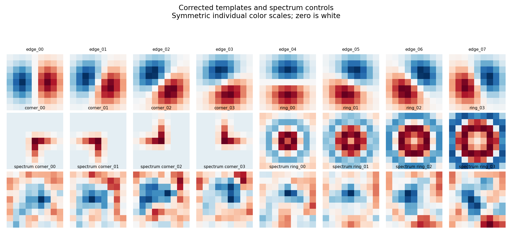
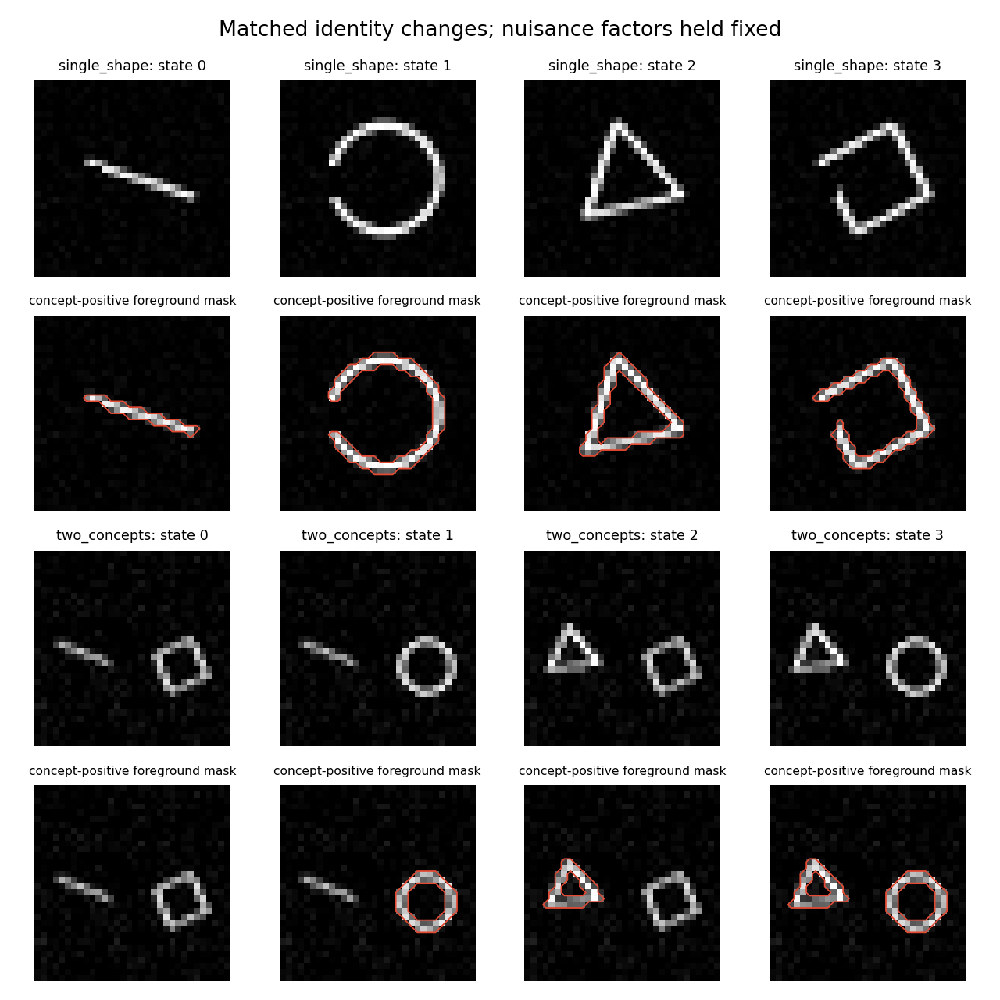

# Does template alignment imply causal usefulness? A controlled second milestone

**Status:** completed experimental milestone; scope-limited scientific evidence, not a claim of causal identifiability or established novelty.  
**Design:** two synthetic tasks × two architectures × ten independent blocks × ten conditions.  
**Provenance:** continuation of the supplied CNN project; the original first-pass experiment is preserved in `../cnn_first_pass/`.

## Abstract

{{ABSTRACT}}

## 1. Introduction

The first pass found that `template_init` retained more kernel alignment than `random` at similarly high observed in-distribution accuracy, while its head-level intervention metrics did not consistently improve. It also revealed duplicated corner filters, dependent adjacent dataset seeds, unequal batch weighting, and a patching metric that counted positive margin movement as success. These issues motivated a new experiment rather than a stronger claim based on the same measurements.

The present question is operational: **when a prior increases kernel alignment, does a small set of independently selected concept channels become more useful for reproducing a matched input intervention?** We distinguish (i) resemblance to a template bank, (ii) selectivity for a renderer-defined concept, and (iii) causal usefulness under a specified intervention and output metric. The study tests whether these move together; it does not assume that one implies the others.

Structured initialization and retained filter structure have prior art, including [Molaei and Shiri Ahmad Abadi](https://doi.org/10.1016/j.asoc.2019.105960), while [Linse et al.](https://arxiv.org/abs/2411.18388) study networks with fixed predefined spatial filters. The current contribution is an experimental comparison, not a claim to have invented structured filters. Concept interventions have a conceptual precedent in [CaCE](https://arxiv.org/abs/1907.07165). Interpretation of activation patching depends on the intervention and metric, as emphasized by [Heimersheim and Nanda](https://arxiv.org/abs/2404.15255). Our fidelity statistic below is a study-defined normalized reconstruction score; it is not presented as the CaCE estimator.

## 2. Protocol and foundation repairs

`PROTOCOL.md` and the training/evaluation source were hashed before any main run. Their hashes and the local timestamp are stored in `design_freeze.json`. This is a local prospective protocol, not an externally registered study. Smoke runs used block 100000 and two epochs solely for execution checks and timing; they are excluded. The final source and protocol hashes are checked again after training.

All results use correct-count divided by example-count. Dataset, model, shuffle, nuisance and control generators have separate named seed namespaces. Blocks 0–9 are independent dataset/model/control blocks, while treatments within each task/architecture/block share images, head initialization and minibatch permutations. Model namespaces differ between architectures, so architectural comparisons are not identical-weight interventions. The same block's tasks and architectures are not pooled as independent replications.

The audit checks every generated main image for exact duplicates across train, validation, test, tasks and blocks; it checks each stream identifier and every balanced label count. Within a context, states deliberately share the exogenous nuisance realization. Those matched observations are dependent and are not treated as independent statistical replicates.

### 2.1 Corrected templates and matched controls

The bank retains 16 entries named `edge_00`…`edge_07`, `corner_00`…`corner_03`, and `ring_00`…`ring_03`, each 9×9, zero-mean and unit L2 norm. Edges retain the original Gaussian-derivative form; rings retain the original radial difference construction. Corners are now Gaussian-weighted two-ray junctions at four right-angle orientations. They are no longer sums of orthogonal Gaussian derivatives, which had collapsed into other edges in the source archive.

The corrected bank has numerical rank 10 at tolerance 10⁻⁶. This is audited rather than hidden: eight oriented derivative edges still span two linear directions. No full-rank or complete geometric basis claim is made. The bank's concepts are hand-designed local structures; the renderer's object identities are defined separately.

For the `spectrum` control, all kernels receive the same random, conjugate-symmetric Fourier phase multiplier. This transformation preserves each kernel's Fourier magnitude and L2 norm, the full inter-kernel Gram matrix, and the bank's singular values/rank, while changing its spatial appearance. A different phase draw is used per block. These matching properties hold at initialization and remain exact when frozen; trainable kernels may depart from their initial spectra and rank. This is a constrained scrambled bank, not an i.i.d. random bank; phase scrambling does not necessarily remove all useful geometric information.

## 3. Methods

### 3.1 Tasks, concepts and matched images

All images are 32×32. This smaller configuration enables the factorial study and is explicitly different from the 64×64 first pass. Shapes are drawn at 3× resolution, then downsampled. Rotation is uniform from 0 to π/4, stroke width 0.8–1.6 pixels, scale 0.85–1.15, and Gaussian noise SD 0–0.05. A 5×5 erasing rectangle is present with probability 0.1. Exact positions, scales, angle, noise hash and occluder coordinates are retained. Renderer masks identify the visible foreground of concept-positive objects, with a predeclared raster threshold of 0.2 after downsampling.

- **`single_shape`:** labels remain `line`, `circle`, `triangle`, `square`. Each independently drawn context produces all four identities with the same translation (±2 pixels), angle, scale, stroke width, noise and occluder. The radius parameter is 10×scale. There are four identity-indicator concepts. Changing an identity changes two one-hot indicators; it is a single categorical intervention, not a one-bit intervention.
- **`two_concepts`:** one object is square or circle and the other is line or triangle, with radius 4.5×scale. Their nominal centers are (8,15) and (24,17), with shared jitter; which slot contains each object family is randomly swapped per context. The label is `circle_present + 2*triangle_present`. Each context contains all four combinations. A counterfactual toggles exactly one binary concept, preserving the other object and nuisance factors.

Each task/block has 128 training contexts (512 images), 64 validation contexts (256 images), and 64 held-out test contexts (256 images). This factorial design balances labels and separates identities from nuisances. It also makes the synthetic tasks more controlled than ordinary randomly sampled image datasets. Test images and labels are never used to rank channels, set activation thresholds, choose regularization, or select checkpoints.

Additional matched nuisance images change translation and pixel-noise realization jointly, preserving labels, angle, scale, width and occluder placement. They are a joint nuisance test, not separate causal estimates for each nuisance variable. Main claims concern matched identity interventions; the original rotation/thickness OOD suites are not reproduced in this milestone.

### 3.2 Architectures and conditions

`TinyCNN` preserves the source topology: bias-free 1→16 convolution (9×9, same padding), ReLU, global spatial maximum, and a 16→4 linear head with bias. `TwoLayerCNN` inserts a bias-free 16→16 3×3 convolution and ReLU before global maximum pooling. They contain 1,364 and 3,668 parameters respectively. Both are shallow CNNs; this is a test of added depth, not broad coverage of modern architectures.

| Condition | First-layer initialization | First-layer updates | Retention λ |
|---|---|---|---|
| `random` | default PyTorch random | trainable | 0 |
| `random_unitnorm` | same random draw, centered/unit norm | trainable | 0 |
| `frozen_random_unitnorm` | centered/unit-norm random | frozen | — |
| `template_init` | corrected template bank | trainable | 0 |
| `template_retention_0.1` | corrected template bank | trainable with anchor penalty | 0.1 |
| `template_retention_1` | corrected template bank | trainable with anchor penalty | 1 |
| `frozen_templates` | corrected template bank | frozen | — |
| `spectrum_init` | matched phase-scrambled bank | trainable | 0 |
| `spectrum_retention_1` | matched phase-scrambled bank | trainable with anchor penalty | 1 |
| `frozen_spectrum` | matched phase-scrambled bank | frozen | — |

“Frozen” always refers to the first convolution. The second convolution, when present, remains trainable. This distinction matters for the optimization diagnostic and for comparing architectures.

### 3.3 Training and retention

Each main model is trained for 40 epochs, batch size 128, Adam learning rate 0.003, no scheduler, no weight decay and no early stopping. Four batches per epoch yield 160 optimizer steps. The final checkpoint is used throughout the main analysis. Every epoch stores sample-weighted training cross-entropy, accuracy, retention penalty, validation cross-entropy and validation accuracy.

The objective is

\[
L = L_{CE} + \lambda\frac{\|W-W_{anchor}\|_F^2}{\|W_{anchor}\|_F^2}.
\]

Only the first convolution is anchored. All structured anchors contain 16 unit-norm kernels, so the denominator is 16. λ=0 leaves the initialized kernels free; frozen conditions prevent all first-layer updates. This is a new soft-retention experiment, unlike the original archive, which contained initialization and freezing only.

### 3.4 Measurements independent of kernel appearance

**Alignment.** For every first-layer kernel, mean-center and compute signed cosine similarity to every corrected template. Average the maximum over kernels. Multiple kernels may choose the same template. Alignment is measured against the corrected reference bank even for `spectrum` conditions; it is not alignment to each model's own anchor. Drift L2 is also retained.

**Concept selectivity.** Compute each channel's globally maximum-pooled first-layer activation. On validation images, rank channels by the absolute positive-versus-negative concept mean difference divided by that channel's overall SD. Choose the best channel and sign on validation, then measure its AUROC on test concepts. Average over the four categorical indicators or two binary concepts. This is single-unit identity selectivity, not disentanglement or a complete concept bottleneck.

**Localization.** Independently select the channel with highest validation foreground IoU for each concept. The activation threshold for each channel is its 95th percentile over all validation images and pixels. Apply the selected channel and threshold to concept-positive test images and calculate pooled intersection/union with visible renderer masks. Average across concepts. The localization channel need not equal the selectivity channel. Neither selection procedure uses the template bank or model-head weights.

### 3.5 Matched causal patching

For `single_shape`, evaluate all 12 directed identity changes per held-out context (768 pairs). For `two_concepts`, evaluate all eight directed one-bit changes per context (512 pairs). Pairs share the exact nuisance context. Internal patching copies selected first-layer **activation maps** from the counterfactual into the base run and propagates through the unchanged remainder of the network. In the deeper model this includes its second convolution, rather than an algebraic shortcut through the final head.

Channel ranking uses the validation concept contrast above: the destination identity for a categorical change, or the toggled binary concept for a compositional change. The primary intervention patches four of sixteen channels. Eight fixed random class/concept-specific rankings provide a same-size baseline; these draws are shared across conditions within a task/block. Selected k=1 and k=8 are secondary. Random baselines are evaluated at k=4.

Let p₀ be the base probability vector, p₁ the probability vector after the actual image intervention, and pₛ the internally patched probability vector. Define effect fidelity

\[
F=1-\frac{\sum_{pairs}\|p_S-p_1\|_2^2}{\sum_{pairs}\|p_1-p_0\|_2^2}.
\]

This is algebraically the reconstruction error between internal and input-induced probability changes. No-op F=0; full-channel patch F=1 when the denominator is nonzero. For example, moving halfway from p₀ to p₁ gives F=0.75. Thus F is an error-reduction score, not the fraction of a causal effect mediated. Negative values mean that the patch is farther from the actual counterfactual output than leaving the model unchanged. If the denominator is below 10⁻¹⁰, fidelity is undefined and cannot support a causal-usefulness estimate.

The primary causal-usefulness measure is

\[
U=F_{selected,k=4}-\frac{1}{8}\sum_{r=1}^{8}F_{random_r,k=4}.
\]

It asks whether validation-selected concept channels are more useful than a random set of the same size. It is not the total usefulness of the network or an absolute causal score for every aligned kernel. We also report counterfactual-label accuracy, agreement with the actual counterfactual prediction, correct-pair subset diagnostics, input-effect magnitude, and k dependence. Fidelity to a model's erroneous counterfactual remains possible, so predictive accuracy must accompany F and U.

### 3.6 Statistical analysis and decision rules

The four prospective primary contrasts are `template_retention_1 − template_init` in U, one per task×architecture. Each uses paired differences across ten independent blocks, a mean, a marginal 95% Student-t interval and a two-sided paired t-test. Holm adjustment controls the family of four primary p-values. Intervals displayed are marginal, not simultaneous Holm-adjusted intervals. t-based inference assumes reasonably behaved block differences; ten blocks provide limited precision and distributional diagnostics.

A positive alignment change establishes the direction of the manipulation; ≥0.10 is the predeclared descriptive threshold for a strong manipulation. A loss of more than five accuracy percentage points is flagged rather than removed. An adjusted positive U effect without that accuracy loss supports the operational hypothesis in that setting. An adjusted negative U effect despite increased alignment contradicts a monotonic benefit in that setting. Other outcomes are inconclusive. A nonsignificant result is not equivalence or evidence that no effect exists.

Other condition contrasts, localization/selectivity effects, pooled-treatment correlations, classifier-refit gains, and k curves are exploratory. Correlation plots do not treat all treatment runs as independent and do not identify an effect of alignment itself: changing a retention penalty changes other properties too.

### 3.7 Optimization versus representation diagnostic

After each main run, hold the learned representation fixed and fit an alternative multinomial linear head. Standardize pooled features using training means/SDs. Use L-BFGS for up to 500 iterations at head L2 strengths 0, 0.001, and 0.1, selecting only by validation cross-entropy. Save all candidates, termination messages, gradient norms, coefficients and selected predictions. This L2 strength is separate from convolution-retention λ.

For frozen `TinyCNN`, a successful accuracy recovery demonstrates that the original Adam-trained head did not exhaust the available representation. For `TwoLayerCNN`, this diagnostic holds its learned second convolution fixed too; it does not solve the full downstream nonconvex optimization problem. Failure of the refit to improve cannot prove that the input information is absent, especially if optimization did not converge. Main causal metrics always use the original trained head; refit results are diagnostic only. An explicitly exploratory supplement, designed after inspecting a 189-run partial table, repeats the same patches using the already validation-selected refitted head for five conditions. It changes no features, channel rankings or primary tests. Its purpose is to assess classifier and probability-calibration sensitivity; see `EXPLORATORY_SUPPLEMENT.md`.

## 4. Results

{{RESULTS}}

## 5. Interpretation

{{INTERPRETATION}}

## 6. Limitations

1. These are two related synthetic tasks, two shallow architectures, a fixed 16-channel width and a 32×32 rendering regime. There are no natural-image experiments or large pretrained models. A result can be decisive about this manipulation and metric without establishing a universal principle.
2. The “concepts” are whole-object identities and presence indicators. They do not independently certify recovery of every local edge, corner or curvature primitive. Foreground IoU is a separate localization measurement, not proof that a unit represents the object's identity.
3. The corrected template bank is intentionally not full rank. Spectrum controls match rank, Gram matrix and Fourier magnitude but preserve other structured relationships as well; they are not guaranteed to be semantically meaningless.
4. The retention manipulation can change classification performance, confidence, feature scale, and downstream adaptation. A U difference cannot be attributed to alignment alone. Accuracy trade-offs and the spectrum controls help constrain the explanation rather than remove all confounding.
5. Channel ranking is one predeclared validation-only standardized contrast. Negative U can expose failure of that ranking, distributed coding, nonlinear interactions, or metric effects; it does not prove that no useful causal channel subset exists.
6. F reproduces the model's probability response. It can be high for an inaccurate model and can become unstable when the actual input effect is small. It is bounded above by 1 but not below. Full-patch and no-op results are identities and checks, not empirical discoveries.
7. Partial activation-map combinations may lie off the natural activation manifold, even though the source/base images are matched. Patching evidence is specific to the chosen layer, distribution and output metric.
8. Only ten independent blocks support each primary contrast. They include both data and initialization variation; these variance components are not separately estimated. Interventions within a context and treatment runs within a block are dependent. Secondary comparisons are exploratory.
9. The training budget is fixed at 160 Adam steps and not guaranteed to be converged. The linear-head refit can diagnose an optimization gap at fixed features but cannot establish a global representation ceiling, particularly for the deeper model.
10. Both tasks deliberately balance all concept states in each nuisance context. This is useful for experimental control and less representative of naturally correlated concepts. Nuisance tests jointly change translation and noise, so they do not isolate each nuisance's effect.
11. The source and protocol were frozen locally before main training, not externally preregistered. Methods were designed with knowledge of the first-pass findings. This milestone is a follow-up experiment, not a blind external replication.
12. No claim of publication novelty or general causal identifiability follows from these experiments alone. A broader literature comparison and independent replication would be required.

## 7. Next milestone, determined by the evidence

{{NEXT}}

## 8. Conclusion

{{CONCLUSION}}

## Appendix: artifacts and reproduction

`README.md` contains runnable commands. `design_freeze.json` records the prospective design and source hashes. `foundation_audit.json` verifies geometry, initialization and spectrum matching. `audit.json` verifies the completed datasets and checkpoints. `data/` contains train/validation/test images, nuisance variants, concept arrays, visible masks and context metadata. `runs/` contains every checkpoint, initial/final convolution, per-epoch history, main scalar result, intervention summaries, probe arrays and all classifier-refit candidates.

`analysis/per_run.csv` is the full run table; `summary.csv` contains means, SDs and marginal confidence intervals; `primary_contrasts.csv` contains the four Holm-adjusted prospective tests; `paired_contrasts.csv` contains exploratory paired comparisons; `head_diagnostics.csv` records the selected classifier refits; `patching_all.json` retains intervention outcomes. All scripts, execution logs, requirements and figures accompany the report. Smoke runs are clearly separated and excluded from every result table.
