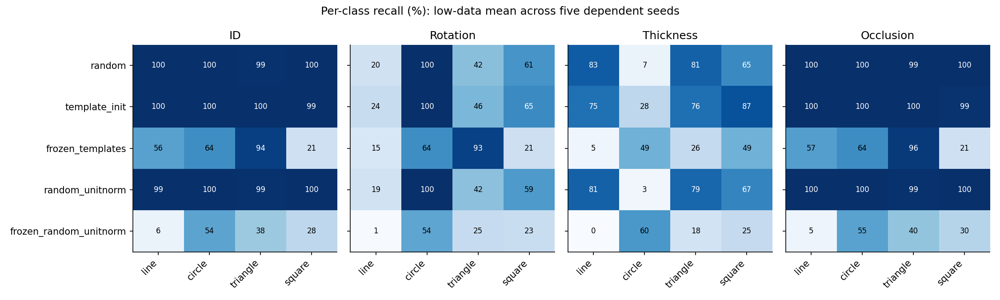
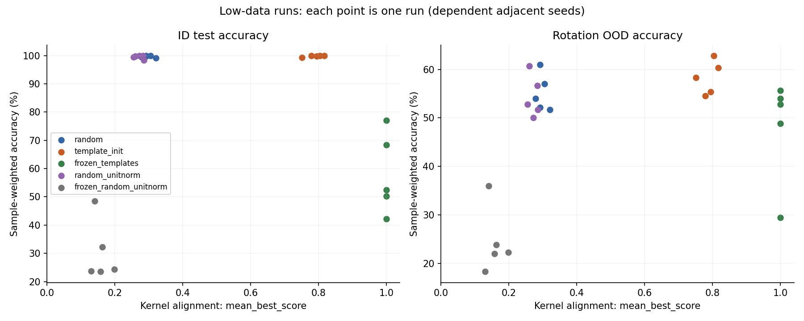
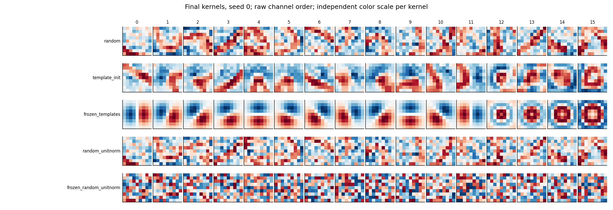
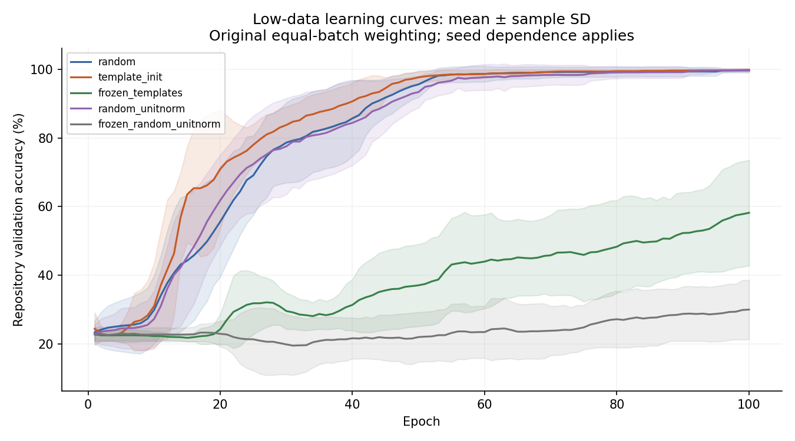
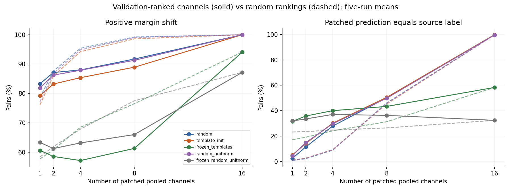

# Random versus template priors in TinyCNN: reproduction and controlled first-pass analysis

**Status:** empirical first-pass report; not a claim of publication-ready evidence.  
**Source:** uploaded `cnn.zip`, recovered from the referenced conversation attachment. The requested `/mnt/data/cnn.zip` path was unavailable on this macOS host.  
**Terminology:** `random`, `template_init`, and `frozen_templates` are the repository regimes. `random_unitnorm` and `frozen_random_unitnorm` are added controls.

## Abstract

We reproduced the executable configurations of a supplied synthetic-shape CNN project after repairing two training-entry-point defects. We completed 28 runs: the three repository regimes (`random`, `template_init`, `frozen_templates`) over five low-data seeds, two normalization-matched random controls over those seeds, and the three original regimes at the larger-data v3 configuration for seed 0. In the low-data suite, sample-weighted ID accuracy was 99.70 ± 0.36% for `random`, 99.83 ± 0.29% for `template_init`, and 58.03 ± 14.23% for `frozen_templates` (mean ± sample SD). Final kernel alignment was 0.298, 0.789, and 1.000, respectively. Template initialization thus retained substantially more bank similarity at similarly high observed ID accuracy; freezing preserved alignment but substantially reduced performance under this training budget. Unit-normalized random initialization did not reproduce the alignment advantage. Template initialization's mean rotation and thickness OOD advantages were variable across seeds and do not establish general robustness. Validation-ranked top-k interventions did not outperform random-channel controls on positive-margin frequency at k=8, and positive-margin frequency differed markedly from prediction transfer. The audit found template redundancy, misleading metric names, unequal batch weighting, and overlapping dataset streams across adjacent seeds. These findings support further controlled study of initialization and retention, but not semantic or causal identifiability claims.


## 1. Introduction and research questions

This project tests whether a small convolutional classifier can retain similarity to predefined visual templates while learning synthetic shape classification. We ask whether the repository's template priors change final accuracy, learning speed, out-of-distribution (OOD) behavior, kernel alignment and drift, class-conditional ablation, and pooled-vector patching. Added controls ask whether outcomes arise from template structure, normalization, or freezing.

The implementation contains initialization and freezing interventions, not a continuous prior-strength parameter, Gabor constraint, or regularization term. Its training loss is cross-entropy alone. This report therefore does not describe a measured λ frontier, semantic identifiability, or a new interpretability method. The earlier literature discussion motivates questions but is not treated as verified evidence or as a specification of what this archive implements. A systematic literature review and novelty assessment are outside this experimental report.

## 2. Source inspection and reproducibility

The archive contains 20 Python source files under `src/` and `scripts/`, alongside macOS metadata and Python bytecode. It contains no README, dependency lockfile, dataset, checkpoint, historical metric table, or archived experiment output. Consequently, we reproduce configurations from scripts; we cannot verify numerical agreement with earlier runs.

The original training entry point fails before training with `NameError: name 'model' is not defined`: its probe/reporting block was dedented out of `main()`. A second defect omits the mandatory `delta_cond` argument to `topk_patching`. The working copy repairs the indentation and supplies `cond_abl.delta_cond`. The original training file, captured failure, and unified patch are retained in `original/train.py`, `original_execution_failure.txt`, and `repairs.patch`. All other uploaded Python files remain unchanged; additions live alongside them. Synced project reference files were not modified.

The analysis keeps the repository's accuracy and probe definitions intact and labels corrected or additional measurements separately. Full commands, return codes, durations, configuration JSON, epoch logs, initial/final kernels, model checkpoints, raw probe arrays, environment versions, and the archive SHA-256 accompany this report.

## 3. Methods

### 3.1 Synthetic task and splits

`ShapesDataset` renders four classes: `line`, `circle`, `triangle`, `square`. Labels are sampled uniformly rather than stratified. Each 64×64 grayscale image contains one outlined shape on a background, inverted to make foreground values positive. The renderer draws at 4–8 times resolution and downsamples with Lanczos. It samples rotation, position, scale, line thickness, Gaussian pixel noise, and possible rectangular occlusion.

| Factor | Train / validation / ID test | OOD change |
|---|---|---|
| Rotation | 0 to π/4 | `ood_rot`: π/4 to 2π |
| Translation | x and y each −6 to +6 pixels | unchanged |
| Scale | 0.8 to 1.2 | unchanged |
| Thickness | 1 to 3 pixels | `ood_thick`: 4 to 6 |
| Noise SD | 0 to 0.10, then clipping to [0,1] | unchanged |
| Occlusion probability | 0.10 | `ood_occ`: 0.40 |
| Occluder width/height | each 6 to 18 pixels | unchanged |
| Supersampling | integer 4 to 8 | unchanged |

These are separately sampled splits, not matched counterfactual images. An occlusion draw can miss the foreground. Rotational symmetries mean `ood_rot` does not imply uniformly novel geometry for every class; circles are rotation-invariant.

For run seed s, the split RNG seeds are s+1 through s+6. Within a run, the regimes receive identical generated examples. Across consecutive run seeds, split RNG streams overlap: for example, seed-0 validation and seed-1 training share seed 2 and an identical image prefix. Similarly, seed-0 ID test and seed-1 validation share seed 3. This compromises independence of five-seed summaries and can place one run's evaluation images in another run's training set. Each model still trains only on its own training split; this is not evidence of within-run train/test leakage. Seed SDs and paired differences below are descriptive, not independent-replication confidence intervals.

### 3.2 Model and template bank

`TinyCNN` has one bias-free 1→16 convolution, 9×9 kernels and same padding, ReLU, spatial maximum pooling (`pooled presence vector` z), and a linear 16→4 classifier with bias. It has 1,364 parameters: 1,296 convolution weights and 68 classifier parameters. Under full freezing, only the 68 head parameters can update, although the convolution parameters retain `requires_grad=True` and a hook zeros their gradients.

The template bank has eight `edge_*`, four `corner_*`, and four `ring_*` entries. Each is mean-centered and L2-normalized. The oriented edges are first-derivative-like Gaussian filters, not Gabor kernels. `corner(theta)` normalizes the sum of two orthogonal oriented edges. Algebraically, because their isotropic Gaussian envelopes coincide, that sum is another oriented edge at theta+π/4. The report retains `corner` as the source name while auditing the actual construction. Ring radii are 1.5, 2.0, 2.5, and 3.0 in the 9×9 kernel.

| Condition | Initial convolution | Trainable convolution? | Provenance |
|---|---|---|---|
| `random` | PyTorch default random initialization | yes | repository baseline |
| `template_init` | all 16 template kernels | yes | repository |
| `frozen_templates` | all 16 template kernels | no updates | repository baseline |
| `random_unitnorm` | same random draw, centered and L2-normalized per kernel | yes | added normalization control |
| `frozen_random_unitnorm` | same centered, unit-norm random kernels | no updates | added freezing/structure control |

All conditions use the same head initialization within a seed: convolution and classifier are constructed before template replacement or added normalization. Neither replacement nor normalization consumes additional random numbers. Data creation uses local NumPy generators. The same seeded training shuffle stream is therefore used within a seed. Normalization controls match mean and norm, not the bank's rank, correlation, spatial spectrum, or orientation coverage.

### 3.3 Training and experiment scope

Adam uses learning rate 0.001, cross-entropy loss, batch size 128, no weight decay, no scheduler, and no early stopping. The final epoch is evaluated; validation maxima and time-to-threshold are descriptive and do not select a checkpoint. CPU computation uses four threads per training process. Independent experiment processes can contend for hardware, so their recorded wall times are not comparable performance benchmarks.

| Suite | Conditions | Seeds | Train / val / each test split | Epochs | Patching pairs |
|---|---|---|---|---|---|
| `v4_lowdata` | all 3 repository regimes | 0–4 | 200 / 400 / 600 | 100 | 1,200 |
| `controls` | 2 added controls | 0–4 | 200 / 400 / 600 | 100 | 1,200 |
| `v3_seed0` | all 3 repository regimes | 0 | 8,000 / 1,000 / 1,000 | 10 | 1,500 |

The v4 data sizes, seeds, epochs, model, and optimizer reproduce the existing low-data script configuration; probes are enabled instead of its default disabled setting. All available test items are used by the probes. The v3 configuration is reproduced for seed 0 only, not the full five-seed suite. The v2 eight-channel grid is not run: taking the first eight bank entries changes both width and template-family coverage, since it includes only `edge_*` filters. The full 16-channel comparison is the controlled focus here.

### 3.4 Repository metrics and their meanings

- **Accuracy:** `evaluate` computes the unweighted mean of batch accuracies. We retain `id_acc`, `ood_rot_acc`, `ood_thick_acc`, and `ood_occ_acc`, and independently recompute sample-weighted accuracy from checkpoints. With 400 validation examples, the last 16 examples receive 25% of the original validation metric's weight rather than 4%. With 600 test examples, the last 88 receive 20% rather than 14.7%. The supplemental majority baseline predicts the most common *training* class.
- **Alignment:** `alignment.mean_best_score` averages each mean-centered kernel's maximum signed cosine similarity over all templates. It permits repeated matches, is relative to this bank, and is not semantic selectivity or concept recovery. Sign matters with ReLU; the score does not maximize absolute cosine.
- **Drift:** mean-centered cosine with each kernel's own initialization and raw L2 displacement. High cosine means directional retention; zero L2 means no change. Mean centering in cosine can hide changes in DC response.
- **Class-conditional ablation:** with logits Vz+b, `delta_cond[i,c] = V[c,i] E[z_i | y=c]`. Specificity is the largest class contribution minus the mean of the others, averaged over channels. It is an exact head-level logit contribution, not an ablated-accuracy score or a calibrated semantic measure.
- **Single-channel patching:** replaces target pooled feature z_t[i] with source z_s[i] for differently labeled image pairs. The reported success is P(Δ source-versus-target margin > 0), not prediction transfer. Mean shift measures raw logit-margin effect size.
- **Top-k patching:** ranks channels by source-class `delta_cond`, patches k∈{1,2,4,8}, and uses the same positive-shift definition. Original ranking and evaluation both use test data. The key `success@maxk` actually stores the maximum success over all k, not necessarily the value at k=8. We preserve the field and report its meaning explicitly.
- **Learning speed:** existing validation `t98`, `t100`, and unnormalized trapezoidal AUC through epochs 10, 20, and 50. Failure to reach a threshold is censored at the training horizon, not a zero or a success. An AUC ending at epoch E integrates epochs 1…E, so its maximum is E−1. Shorter v3 runs do not support AUC through 20/50; those supplemental table cells are left undefined.

### 3.5 Additional controls and validation

Supplemental patching ranks channels using validation labels and activations, then evaluates on ID test pairs. At each k∈{1,2,4,8,16}, we compare against 20 fixed random class-specific channel rankings and report positive-margin shift, mean shift, prediction change, source-label prediction, and source-label prediction conditional on both original images being correctly classified. This last subset can differ between models; the unconditional comparison uses identical pairs within each seed.

No-op interventions must leave logits unchanged. Patching all 16 features must recover the source logits, since the head is linear; this is a sanity identity, not evidence of identified concepts. We check the ablation formula against direct head evaluation, reproduce original ID accuracy from every saved checkpoint, and verify frozen filters remain bitwise unchanged. Saved alignment matrices are also checked against direct float64 summation to a tolerance of 10⁻⁵. Some local NumPy matrix operations emitted numerical warnings; only finite, independently checked measurements are accepted. All patching intervenes on pooled z, not on spatial maps or rendered generative factors. Pairs are sampled with replacement from the same test bank; 1,200 pairs are not 1,200 independent images.

## 4. Results

### 4.1 Completion and audit

All 28 planned training runs completed: 15 v4, 10 added controls, and 3 v3 seed-0 runs. Every checkpoint passed original-ID-accuracy reproduction, ablation-identity, no-op, and full-vector-patching checks. All frozen filters were bitwise unchanged. The 16-entry bank has numerical rank **6** at singular-value tolerance 10⁻⁶; all four `corner` entries have absolute cosine approximately 1 with an `edge` entry.

One added-control launch failed before training because a norm call selected a matrix-norm overload; it was repaired to use an explicit vector norm and successfully rerun. This development failure is retained in `execution.jsonl`; it generated no reported results. The untouched source was independently observed to fail as documented in Section 2.

### 4.2 Low-data predictive accuracy

Percentages are sample-weighted **mean ± sample SD** over five paired but dependent seeds. They use final-epoch checkpoints, not validation-best checkpoints.

| Condition | ID (%) | ood_rot (%) | ood_thick (%) | ood_occ (%) |
| --- | --- | --- | --- | --- |
| `random` | 99.70 ± 0.36 | 55.17 ± 3.87 | 59.07 ± 10.98 | 99.80 ± 0.30 |
| `template_init` | 99.83 ± 0.29 | 58.27 ± 3.46 | 66.53 ± 12.80 | 99.63 ± 0.38 |
| `frozen_templates` | 58.03 ± 14.23 | 48.17 ± 10.73 | 32.43 ± 5.57 | 59.07 ± 15.57 |
| `random_unitnorm` | 99.53 ± 0.70 | 54.37 ± 4.29 | 57.70 ± 11.30 | 99.63 ± 0.49 |
| `frozen_random_unitnorm` | 30.43 ± 10.73 | 24.50 ± 6.74 | 25.50 ± 1.03 | 32.90 ± 10.73 |

The training-majority classifier scores ID: 23.30 ± 1.08%, rotation: 23.77 ± 1.66%, thickness: 24.67 ± 1.52%, occlusion: 25.17 ± 1.38%. Uniform guessing has expected accuracy 25%; it is not an additional trained model.

Original repository equal-batch accuracy, retained for reproduction:

| Condition | id_acc (%) | ood_rot_acc (%) | ood_thick_acc (%) | ood_occ_acc (%) |
| --- | --- | --- | --- | --- |
| `random` | 99.69 ± 0.34 | 55.24 ± 3.85 | 59.28 ± 11.08 | 99.81 ± 0.28 |
| `template_init` | 99.83 ± 0.30 | 58.28 ± 3.40 | 66.61 ± 12.42 | 99.64 ± 0.36 |
| `frozen_templates` | 57.90 ± 14.18 | 48.03 ± 10.74 | 32.41 ± 5.44 | 58.88 ± 15.38 |
| `random_unitnorm` | 99.53 ± 0.68 | 54.42 ± 4.29 | 57.90 ± 11.40 | 99.63 ± 0.52 |
| `frozen_random_unitnorm` | 30.35 ± 10.61 | 24.47 ± 6.75 | 25.51 ± 1.10 | 32.82 ± 10.56 |

The largest original-versus-sample-weighted discrepancy across the low-data final ID/OOD measurements is 0.73 percentage points.

Per-class recall, computed within each run and then averaged, shows where errors concentrate:



### 4.3 Alignment, drift, and repository probes

| Condition | Initial alignment | Final alignment | Drift cosine | Drift L2 | Mean specificity |
| --- | --- | --- | --- | --- | --- |
| `random` | 0.158 ± 0.026 | 0.298 ± 0.016 | 0.591 ± 0.018 | 0.971 ± 0.032 | 0.908 ± 0.043 |
| `template_init` | 1.000 ± 0.000 | 0.789 ± 0.025 | 0.786 ± 0.027 | 0.917 ± 0.075 | 0.838 ± 0.099 |
| `frozen_templates` | 1.000 ± 0.000 | 1.000 ± 0.000 | 1.000 ± 0.000 | 0.000 ± 0.000 | 0.378 ± 0.021 |
| `random_unitnorm` | 0.158 ± 0.026 | 0.271 ± 0.013 | 0.759 ± 0.013 | 0.956 ± 0.046 | 0.915 ± 0.036 |
| `frozen_random_unitnorm` | 0.158 ± 0.026 | 0.158 ± 0.026 | 1.000 ± 0.000 | 0.000 ± 0.000 | 0.187 ± 0.030 |

| Condition | Single success (fraction) | Single mean shift | Best top-k success (fraction) | Top-k mean shift |
| --- | --- | --- | --- | --- |
| `random` | 0.776 ± 0.016 | 0.332 ± 0.031 | 0.917 ± 0.016 | 1.498 ± 0.110 |
| `template_init` | 0.749 ± 0.014 | 0.266 ± 0.053 | 0.889 ± 0.011 | 1.198 ± 0.175 |
| `frozen_templates` | 0.562 ± 0.010 | 0.026 ± 0.004 | 0.625 ± 0.012 | 0.109 ± 0.017 |
| `random_unitnorm` | 0.762 ± 0.028 | 0.310 ± 0.042 | 0.913 ± 0.020 | 1.445 ± 0.138 |
| `frozen_random_unitnorm` | 0.589 ± 0.037 | 0.014 ± 0.007 | 0.666 ± 0.064 | 0.067 ± 0.035 |

“Success” in this table is positive margin movement. The best top-k value is the repository’s `success@maxk` field, maximized over k. It must not be read as classification accuracy or semantic fidelity. Frozen alignment ≈1 is imposed by construction.





### 4.4 Learning speed and threshold attainment

| Condition | Final val (%) | Max val (%) | t98: reached; median epoch | t100: reached; median epoch | AUC10 | AUC20 | AUC50 |
| --- | --- | --- | --- | --- | --- | --- | --- |
| `random` | 99.69 ± 0.60 | 99.69 ± 0.60 | 5/5; median 53 | 3/5; median 65 | 2.30 ± 0.66 | 6.69 ± 1.84 | 30.93 ± 4.18 |
| `template_init` | 99.84 ± 0.16 | 99.84 ± 0.16 | 5/5; median 52 | 2/5; median 71 | 2.25 ± 0.44 | 7.86 ± 1.91 | 33.85 ± 2.61 |
| `frozen_templates` | 58.20 ± 15.39 | 58.71 ± 15.73 | 0/5; not reached | 0/5; not reached | 2.02 ± 0.14 | 4.25 ± 0.24 | 13.70 ± 2.24 |
| `random_unitnorm` | 99.73 ± 0.51 | 99.73 ± 0.51 | 5/5; median 56 | 3/5; median 79 | 2.21 ± 0.50 | 6.75 ± 1.63 | 30.96 ± 4.61 |
| `frozen_random_unitnorm` | 30.00 ± 8.65 | 30.86 ± 8.62 | 0/5; not reached | 0/5; not reached | 2.05 ± 0.20 | 4.34 ± 0.42 | 10.70 ± 2.50 |

Threshold medians include only runs that reached the threshold; the accompanying fraction exposes censoring. These are original batch-weighted validation metrics. Max validation is a trajectory summary, not the reported model-selection rule.



### 4.5 Controlled comparisons

Paired differences are treatment minus reference, computed within each seed; predictive columns are percentage points. Alignment remains in cosine-score units. Values are mean ± SD of the five paired differences, without significance tests.

| Treatment − reference | ID pp | Rotation pp | Thickness pp | Occlusion pp | Alignment |
| --- | --- | --- | --- | --- | --- |
| `template_init` − `random` | 0.13 ± 0.49 | 3.10 ± 4.17 | 7.47 ± 13.93 | -0.17 ± 0.55 | 0.491 ± 0.031 |
| `random_unitnorm` − `random` | -0.17 ± 0.37 | -0.80 ± 0.88 | -1.37 ± 5.58 | -0.17 ± 0.20 | -0.027 ± 0.007 |
| `template_init` − `random_unitnorm` | 0.30 ± 0.82 | 3.90 ± 4.70 | 8.83 ± 17.34 | 0.00 ± 0.72 | 0.518 ± 0.025 |
| `frozen_templates` − `frozen_random_unitnorm` | 27.60 ± 11.03 | 23.67 ± 11.66 | 6.93 ± 4.94 | 26.17 ± 13.12 | 0.842 ± 0.026 |
| `template_init` − `frozen_templates` | 41.80 ± 14.44 | 10.10 ± 13.74 | 34.10 ± 11.45 | 40.57 ± 15.77 | -0.211 ± 0.025 |

### 4.6 Validation-ranked intervention controls

The table uses k=8 and the same ID test source/target pairs per seed. Random ranking averages 20 class-specific ranking draws within each run.

| Condition | Validation-ranked positive shift (%) | Random-ranked positive shift (%) | Source-label prediction (%) | Source-label prediction, both initially correct (%) |
| --- | --- | --- | --- | --- |
| `random` | 91.72 ± 1.57 | 99.23 ± 0.33 | 50.13 ± 2.52 | 50.03 ± 2.58 |
| `template_init` | 88.93 ± 1.15 | 98.58 ± 0.42 | 50.52 ± 2.53 | 50.52 ± 2.53 |
| `frozen_templates` | 61.27 ± 1.97 | 76.51 ± 2.88 | 43.38 ± 4.22 | 47.58 ± 5.07 |
| `random_unitnorm` | 91.28 ± 1.97 | 99.07 ± 0.48 | 49.82 ± 1.49 | 49.84 ± 1.49 |
| `frozen_random_unitnorm` | 65.98 ± 7.17 | 77.49 ± 8.98 | 36.35 ± 6.54 | nan ± nan |

The conditional column uses model-dependent subsets. No-op positive shifts and prediction changes are zero. No-op source-label prediction can be nonzero when the target was already misclassified; per-run values are retained in `analysis/details.json`. At k=16, the source logits are recovered by algebra, irrespective of whether its prediction is correct. These controls demonstrate head-level intervention behavior, not identified causal concepts.



### 4.7 Existing v3 configuration, seed 0

This is a single-seed reproduction with 8,000 training examples and 10 epochs, not a replicated data-scaling study. Percentages are sample-weighted; there is no seed SD.

| Condition | ID (%) | ood_rot (%) | ood_thick (%) | ood_occ (%) |
| --- | --- | --- | --- | --- |
| `random` | 100.00 | 59.70 | 61.40 | 100.00 |
| `template_init` | 100.00 | 59.00 | 78.80 | 100.00 |
| `frozen_templates` | 80.20 | 62.70 | 42.20 | 79.80 |

| Condition | Alignment | Drift cosine | Specificity | Single success (fraction) |
| --- | --- | --- | --- | --- |
| `random` | 0.300 | 0.417 | 2.283 | 0.771 |
| `template_init` | 0.642 | 0.630 | 1.779 | 0.744 |
| `frozen_templates` | 1.000 | 1.000 | 0.569 | 0.572 |

v4 uses 200 optimizer steps (2 batches × 100 epochs); v3 uses 630 (63 × 10). Dataset size, exposure, and update budget therefore differ simultaneously. Compare within each suite; cross-suite differences do not identify an isolated data-size effect. All unabridged metrics, confusion matrices, and intervention curves are retained in the accompanying data.


## 5. Interpretation

### 5.1 What changed, and what did not

The strongest finding is **retained kernel alignment at high observed ID accuracy**, not an accuracy breakthrough. `template_init` exceeds `random` by only 0.13 percentage points in mean ID accuracy, with SD 0.49 points for the paired difference. Its alignment advantage is much larger: +0.491 ± 0.031. Both models can solve this ID task almost perfectly while occupying very different positions relative to the template bank. These measurements do not establish statistical equivalence of accuracy, but show no large observed ID penalty for template initialization in this setting.

The centering/unit-norm control is informative. `random_unitnorm` reaches 99.53% ID accuracy and alignment 0.271, compared with 99.83% and 0.789 for `template_init`. Thus, matching the bank's normalization does not reproduce its alignment advantage. This supports an effect of the structured initial bank beyond normalization alone, while leaving its rank and spectral properties as unresolved explanations. The mechanisms consistent with the implementation are straightforward: initialization starts kernels on the bank and training moves them away; freezing prevents that movement completely. We did not measure a separate force that keeps trainable kernels aligned.

### 5.2 Freezing exposes a trade-off under this budget, not a proven capacity limit

`frozen_templates` retains alignment 1 by construction but reaches only 58.03% mean ID accuracy, compared with 99.83% for trainable templates. It nevertheless outperforms `frozen_random_unitnorm` by 27.60 ± 11.03 percentage points. The fixed template representation is useful relative to the matched fixed random representation, yet updating the convolution is much more effective under the tested schedule.

This does not prove that a frozen-template linear head has an intrinsic 58% ceiling. In the v3 seed-0 run it reaches 80.2% ID accuracy, with both more examples and more optimizer steps. A separately converged head optimization is needed to distinguish representational limitations from optimization and finite-data effects. Likewise, the low-data trajectory summaries offer only modest evidence of faster learning from templates: mean AUC50 is higher, but median t98 differs by just one epoch (52 versus 53), and these metrics use the original unequal batch weighting.

### 5.3 OOD behavior is mixed and class-specific

Low-data `template_init` improves mean rotation accuracy by 3.10 ± 4.17 percentage points and thickness accuracy by 7.47 ± 13.93 points relative to `random`. The variation in the paired thickness effect is larger than the mean effect. In v3 seed 0, template initialization improves thickness accuracy (78.8% versus 61.4%) but slightly decreases rotation accuracy (59.0% versus 59.7%). There is no demonstrated uniform OOD advantage.

The per-class measurements localize the failures. In low-data rotation OOD, both trainable regimes retain approximately 100% circle recall while line recall falls to approximately 20% (`random`) or 24% (`template_init`). This is consistent with the rotation-invariant circle geometry and the narrow training angle range, though a matched-factor experiment is needed for a causal explanation. Thickness OOD is particularly damaging to circle classification: mean recall is approximately 7% for `random` and 28% for `template_init`; template initialization also helps square recall but reduces line and triangle recall in this comparison. These are not uniform improvements across all concepts.

Near-perfect `ood_occ` accuracy for trainable models should be interpreted in the context of the renderer: it raises the probability of a randomly placed erasing rectangle, not a controlled amount of foreground removal. This particular split is not a demanding demonstration of occlusion robustness.

### 5.4 Alignment does not imply superior causal interpretability

The repository's mean single-channel positive-shift score is lower for `template_init` than `random` (0.749 versus 0.776), despite much higher alignment. Mean specificity is also lower (0.838 versus 0.908). Neither raw magnitude nor positive-shift frequency defines interpretability quality, but these results clearly do not support the claim that alignment automatically improves the existing probes.

The supplemental controls make the distinction sharper. At k=8, validation-ranked patching gives positive shifts on 88.93% of pairs for `template_init`, while random-ranked channels give 98.58%. Yet the targeted patched prediction equals the source label on only 50.52% of pairs. For `random`, the corresponding targeted positive-shift and source-prediction values are 91.72% and 50.13%. A frequently positive margin shift is therefore not a successful semantic transfer in the ordinary classification sense.

The ranking rule selects large correct-class contributions, not the largest source-versus-target contrasts. That difference is one plausible reason random selections can outperform the ranking on positive-shift frequency; it is a hypothesis to test, not an established explanation. Targeted selection can still improve actual source-prediction transfer relative to random selection, as the curves show. The controls expose dependence on the outcome definition rather than proving that every targeted intervention is useless.

### 5.5 What this first pass contributes

This study supplies a reproducible baseline, exposes implementation and measurement issues, and narrows the next research question: **can a well-specified, nonredundant prior preserve independently measured semantic and causal structure while retaining predictive performance?** The current archive measures kernel-bank resemblance and exact interventions at a linear head. It does not yet supply the independent semantic annotations, matched generative interventions, or validated prior-strength sweep needed to answer that stronger question.


## 6. Limitations

1. These are synthetic single-shape images, one shallow architecture, a small structured template bank, and a restricted optimization budget. Findings do not generalize automatically to natural images, deeper CNNs, or other priors.
2. Five adjacent seeds are dependent through the split-seed scheme. The v3 comparison has one seed. Descriptive SDs are not a substitute for independent replicated datasets and model seeds.
3. The template bank has redundant channels and `corner` entries that are edges in the implemented formula. Alignment with this bank does not establish semantic or causal identifiability.
4. Normalization-matched random controls leave rank, spectrum, redundancy, and directional coverage unmatched. They reduce confounding but do not isolate every feature of a template prior.
5. The original test-ranked top-k probe uses evaluation labels to choose channels. Validation-ranked supplements address this selection reuse, but the validation and test populations are still synthetic and the intervened feature combinations need not lie on the renderer's data manifold.
6. Positive margin movement can be arbitrarily small and need not change a prediction. Raw logit contribution and margin magnitudes are not directly calibrated across models; high specificity is not inherently superior interpretability.
7. The original accuracy weighting affects validation curves and threshold times. Supplemental final accuracy corrects weighting, but weighted historical validation curves cannot be reconstructed without epoch checkpoints, which the source does not save.
8. Max pooling discards spatial arrangement. Probes operate at the linear head and do not demonstrate recovery of rendering factors, localization, sufficiency of semantic parts, or full-network causal abstraction.
9. No historical outputs were supplied. Numerical historical reproduction cannot be claimed, and the execution repairs may not coincide with the author's earlier working version.
10. Final-epoch results do not establish converged performance or a complete accuracy–alignment frontier. No prior-strength sweep, confidence-calibrated hypothesis test, or confirmatory held-out experiment was performed.

## 7. Concrete next experiments

1. **Repair evaluation and seed isolation first.** Use `SeedSequence.spawn` or non-overlapping, named RNG streams for dataset, model, shuffle, and probes. Hold a disjoint final test bank fixed and pair treatments on it. Use sample counts in every accuracy average. Save epoch checkpoints or predictions. Repeat with at least 10 independent data/model blocks; report paired effect estimates and intervals at the independent-block level.
2. **Repair and factor the template bank.** Implement actual corner/junction patterns with a stated geometry, inspect rendered filters, and audit rank. Compare edges-only, rings-only, corrected corners, and mixed banks at matched channel count and norm. Add rank- and spectrum-matched random banks to determine whether observed differences arise from structure or redundant basis coverage.
3. **Separate initialization, freezing, and soft retention.** Keep the existing regimes as anchors; add a clearly defined normalized penalty λ‖W−T‖² (or another explicitly justified objective) across predeclared λ∈{0,10⁻⁴,10⁻³,10⁻²,10⁻¹,1}. Include zero-strength and frozen endpoints, tune only on validation, and evaluate final accuracy, weight alignment, and independent semantic/causal scores. This would be a new experiment, not a result already present here.
4. **Test optimization versus capacity.** Extend frozen-head training and sweep head learning rate with a validation-only selection rule. Compare validation loss trajectories and an independently optimized linear head on fixed pooled features. Extend trainable models to equal update budgets and compare low-data sizes 50, 200, 1,000, and 8,000. Distinguish compute budget from number of epochs.
5. **Measure semantic recovery using the renderer.** Retain complete metadata, including actual occluder placement and pixel masks; add matched images that change exactly one factor. Measure spatial activation overlap and selectivity for edges, junctions, or curvature rather than assigning whole-class semantics from kernel appearance.
6. **Strengthen causal probes.** Rank on training/validation only; use a disjoint pair bank; include no-op, random-channel, matched-magnitude, and sign controls. Report full prediction transfer and logit effects with uncertainty. Test factor-matched source/target pairs, account for nuisance changes, and compare pooled-vector with spatial-feature interventions.
7. **Target observed OOD failure modes.** Add class-specific rotation/thickness sweeps with identical base factors, measure actual visible occlusion fraction, and compare training augmentation against prior changes. This tests whether priors improve robustness beyond direct coverage of the shifted factor.

## 8. Conclusion

In this TinyCNN experiment, template initialization preserves substantially more kernel-bank alignment while reaching similarly high observed ID accuracy as random initialization. Freezing preserves alignment exactly but reduces accuracy under the tested budgets; normalization-matched controls show that template structure contributes beyond normalization alone. OOD advantages are variable, and the existing ablation/patching metrics do not establish superior semantic or causal interpretability. The next defensible step is to repair seed isolation, accuracy weighting, and template construction, then run independently replicated retention and intervention experiments with explicit controls.


## Appendix A. Artifacts and reproduction

Run from the `cnn_first_pass` directory with the recorded Python environment:

```sh
.venv/bin/python run_experiments.py
.venv/bin/python run_controls.py
.venv/bin/python analyze.py
.venv/bin/python build_report.py
```

The launchers skip completed outputs; use a fresh output directory or archive existing `runs/` to retrain. `requirements-lock.txt` records installed dependencies. The source train entry point is also directly runnable using commands recorded in `execution.jsonl`.

- `PROTOCOL.md`: design specified before observed training results, including the control amendment.
- `archive_sha256.txt`, `source_manifest.json`, `repairs.patch`: provenance.
- `runs/`: per-run configurations, training logs, original metrics, probe arrays, kernels, and checkpoints.
- `analysis/per_run.csv`: all original and supplemental scalar metrics per run.
- `analysis/details.json`: split hashes/counts, confusion matrices, top-k arrays, supplemental intervention results.
- `analysis/audit.json`: numerical checks, environment, and template-bank audit.
- `analysis/summary.csv`: grouped mean and sample SD; threshold infinities are censoring, not numeric successes.
- `execution.jsonl`, `execution_progress.log`, `controls_progress.log`, `logs/`: complete execution evidence, including any failed attempts.

## Appendix B. Repository source references

Methods are grounded in `src/data/shapes.py`, `src/templates/primitives.py`, `src/models/cnn.py`, and the repaired `src/train.py`; metric definitions come from `src/interpret/alignment.py`, `drift.py`, `ablation.py`, and `patching.py`. Experiment presets are in `scripts/run_multiseed_v3.py`, `run_multiseed_v4_lowdata.py`, and `run_grid_v2.py`; learning-curve and threshold conventions come from `src/analysis/aggregate.py` and `scripts/aggregate_runs_v4_lowdata.py`. These supplied sources, rather than uncrosschecked historical chat claims, are the authoritative references for this report.
